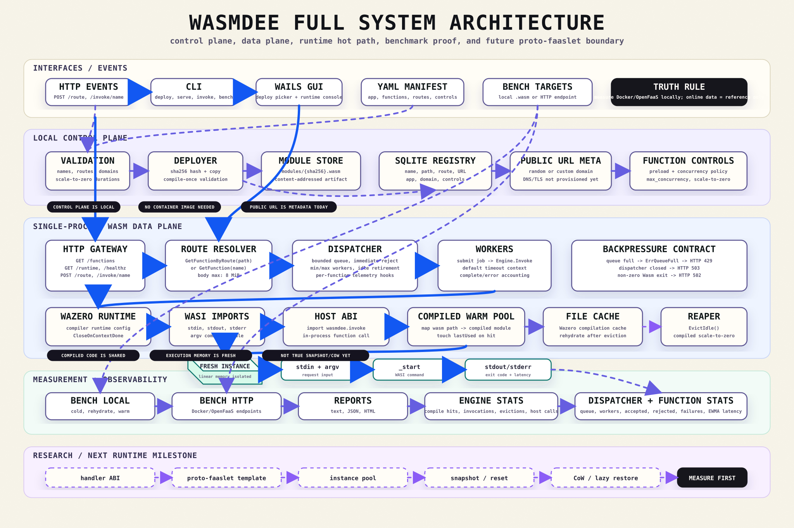
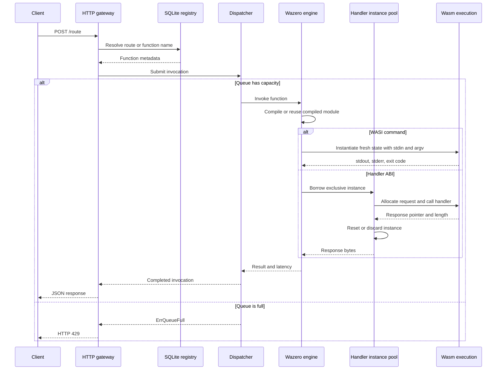

<div align="center">

# wasmdee

### A local-first, Wasm-native serverless runtime

Deploy WebAssembly functions, expose HTTP routes, and execute them through one
shared runtime instead of one container process per function.

[](https://github.com/AppajiDheeraj/wasmdee/actions/workflows/ci.yml)
[](https://go.dev/)
[](https://wazero.io/)
[](https://wasi.dev/)
[](LICENSE)

[Quick start](#quick-start) ·
[Architecture](#architecture) ·
[Deployment manifest](#deployment-manifest) ·
[Runtime model](#runtime-model) ·
[Project status](#project-status)

</div>

---

## Overview

wasmdee is an experimental serverless function platform built around a
single-process WebAssembly data plane.

The runtime keeps Wazero, WASI imports, compiled modules, a bounded dispatcher,
and telemetry alive at the node level. Each stable WASI command invocation still
receives a fresh module instance and isolated linear memory.

This provides a practical foundation for studying:

- container-free function packaging;
- compiled-module reuse;
- bounded admission control;
- local worker autoscaling;
- compiled-module scale-to-zero and cache rehydration;
- direct in-process function calls;
- proto-faaslet templates and handler-oriented instance pools.

> [!IMPORTANT]
> wasmdee is an active runtime prototype. It is not production-ready, and it
> does not yet implement true snapshot/CoW memory restoration, lazy page restore,
> external DNS provisioning, or cluster-wide scheduling.

## Why wasmdee

Traditional FaaS systems commonly package functions as container images and
place image distribution, process startup, orchestration, and network proxies
on the execution path.

wasmdee explores a different node architecture:

| Container-oriented FaaS | wasmdee direction |
|---|---|
| Container image per function | Content-addressed `.wasm` module |
| Runtime/process per replica | Shared Wazero runtime per node |
| Unbounded pressure can overload workers | Bounded queue with explicit rejection |
| Repeated decode and compilation | In-memory compiled modules plus file-backed cache |
| HTTP between local functions | Experimental `wasmdee.invoke` host call |
| Replica scale-to-zero | Compiled-module eviction and cache rehydration |
| Snapshot behavior depends on container/runtime | Proto-faaslet and handler-pool research path |

The goal is not to claim that Wasm automatically wins every workload. The goal
is to build a runtime whose isolation, latency, memory behavior, and trade-offs
can be measured and explained.

## Features

### Deployment and routing

- Deploy a single `.wasm` module from the CLI.
- Deploy multiple functions through a YAML application manifest.
- Validate application names, function names, routes, domains, and durations.
- Store modules by SHA-256 digest in a local content-addressed store.
- Register function metadata and routes in SQLite.
- Invoke by function name or deployment route.
- Record generated or custom public URL metadata.

### Runtime

- Long-lived Wazero runtime with WASI support.
- In-memory compiled-module warm pool.
- File-backed Wazero compilation cache.
- Fresh WASI module instance for each command invocation.
- Preload deployed modules during gateway or GUI startup.
- Idle compiled-module eviction.
- Experimental `wasmdee.invoke` function-to-function host ABI.

### Scheduling and telemetry

- Bounded dispatcher queue.
- Minimum and maximum worker configuration.
- Queue-pressure-based local scale-up.
- Idle retirement of burst workers.
- HTTP `429` response when the runtime queue is full.
- Engine, dispatcher, preload, and per-function telemetry.

### Proto-faaslet foundation

- Runtime-level proto-faaslet template registry.
- Strict handler ABI and export-signature validation.
- Exclusive borrowing from pre-instantiated per-function pools.
- Request/response memory bounds and reset-before-reuse semantics.
- Discard-on-failure behavior with available, in-use, wait, and discard telemetry.

WASI command traffic still uses fresh instances. Modules that implement the
complete handler ABI use the pooled path automatically. This is reusable
instance execution, not snapshot or CoW restoration.

## Architecture



The repository also contains editable diagram sources:

- [Detailed architecture SVG](docs/diagrams/wasmdee_deep_architecture.svg)
- [Simplified architecture SVG](docs/diagrams/wasmdee_arrow_architecture.svg)
- [Event trace Excalidraw file](docs/diagrams/wasmdee_event_trace.excalidraw)
- [Code-path system trace](docs/tracing.md)
- [Architecture notes and trade-offs](docs/architecture.md)

### Invocation path



## Quick Start

### Requirements

- Go 1.25 or newer
- Git
- A WASI-compatible `.wasm` command module
- Node.js 22 only when building the desktop frontend

### Build the CLI

```bash
git clone https://github.com/AppajiDheeraj/wasmdee.git
cd wasmdee
make build
```

The binary is written to `bin/wasmdee`.

### Deploy and invoke a function

```bash
./bin/wasmdee deploy ./hello.wasm \
  --name hello \
  --route /hello
```

```bash
./bin/wasmdee invoke hello \
  --data '{"name":"world"}'
```

### Start the gateway

```bash
./bin/wasmdee serve \
  --addr 127.0.0.1:8080 \
  --min-workers 2 \
  --max-workers 16 \
  --queue-size 1024 \
  --preload
```

Invoke through the assigned route:

```bash
curl --request POST \
  --data '{"name":"world"}' \
  http://127.0.0.1:8080/hello
```

Or invoke explicitly by function name:

```bash
curl --request POST \
  --data '{"name":"world"}' \
  http://127.0.0.1:8080/invoke/hello
```

## Deployment Manifest

Applications can declare multiple functions in `wasmdee.yaml`:

```yaml
version: 1
name: example-api
domain: api.example.com

functions:
  - name: hello
    source: ./hello.wasm
    route: /hello
    deploy: true
    controls:
      preload: true
      max_concurrency: 64
      scale_to_zero_after: 5m

  - name: health
    source: ./health.wasm
    route: /health
    deploy: true
```

Deploy the application:

```bash
./bin/wasmdee deploy --config ./wasmdee.yaml
```

`preload`, `max_concurrency`, and `scale_to_zero_after` are enforced by the
runtime. Unknown or unsupported controls are rejected during deployment.

Custom domains generate public URL metadata. DNS records, certificates, ingress,
and externally reachable routing are not provisioned by the current local
control plane.

## CLI

| Command | Purpose |
|---|---|
| `wasmdee deploy <file.wasm>` | Validate, store, and register one function |
| `wasmdee deploy --config wasmdee.yaml` | Deploy a multi-function application |
| `wasmdee list` | List registered functions |
| `wasmdee invoke <name>` | Invoke through a short-lived local engine |
| `wasmdee serve` | Start the long-lived HTTP gateway and dispatcher |
| `wasmdee bench <target>` | Run engineering latency measurements |

Useful gateway endpoints:

| Method | Endpoint | Purpose |
|---|---|---|
| `GET` | `/healthz` | Engine and dispatcher health |
| `GET` | `/runtime` | Runtime, preload, function, and proto-faaslet telemetry |
| `GET` | `/functions` | Registered function metadata |
| `POST` | `/invoke/{name}` | Invoke by function name |
| `POST` | `/{route}` | Invoke through a deployment route |

## Runtime Model

### Shared per node

- Go process;
- Wazero runtime;
- WASI host module;
- `wasmdee.invoke` host module;
- compiled Wasm modules;
- file-backed compilation cache;
- dispatcher workers;
- SQLite registry and module store.

### Isolated per WASI invocation

- module instance;
- linear memory;
- stdin, stdout, and stderr buffers;
- argv;
- timeout context;
- exit code and invocation result.

### Cold, rehydrate, and warm behavior

| Path | Behavior |
|---|---|
| Cold | Create an engine and compile the module without an in-process entry |
| Rehydrate | Reload after in-memory eviction while retaining the file-backed cache |
| Warm | Reuse the engine and compiled module, then instantiate fresh execution state |
| Handler pool | Borrow a pre-instantiated handler, copy request bytes into linear memory, execute, reset, and return it |
| Snapshot/CoW | Planned research milestone |

## Desktop Console

The desktop application is built with Wails and React. It imports the same
deployment, state, dispatcher, and runtime packages used by the CLI.

The current console supports:

- native `.wasm` file selection;
- local deployment;
- function and route inspection;
- stdin and argv invocation;
- stdout, stderr, exit-code, and latency inspection;
- engine and dispatcher telemetry;
- preload, proto-template, and handler-pool visibility;
- light and dark appearances.

Authentication is optional. Without Supabase configuration, the application
opens directly as a local runtime console.

## Project Structure

```text
.
├── cmd/wasmdee/             CLI entry point
├── internal/
│   ├── cli/                 Commands and HTTP gateway
│   ├── config/              State, cache, module, and log paths
│   ├── deploy/              Manifest parsing, validation, and deployment
│   ├── runtime/             Engine, dispatcher, telemetry, proto store, pools
│   └── state/               SQLite function registry
├── gui/
│   ├── app.go               Wails-to-runtime bridge
│   └── frontend/            React desktop interface
├── docs/
│   ├── architecture.md      Runtime decisions and trade-offs
│   ├── tracing.md           End-to-end code-path tracing
│   ├── benchmarking.md      Reproducible measurement rules
│   └── diagrams/            Editable SVG and Excalidraw architecture files
├── examples/hello/          Example configuration
├── examples/handler/        Runnable pooled-handler fixture
├── benchmarks/docker/       Same-machine container baseline
├── scripts/                 Reproducible comparison workflow
├── tools/handler-example/   Zero-dependency fixture generator
├── Makefile
└── .github/workflows/ci.yml
```

## Project Status

| Capability | Status |
|---|---|
| CLI deploy, invoke, and list | Working MVP |
| YAML multi-function deployment | Working MVP |
| HTTP routes and gateway | Working MVP |
| Long-lived engine and compiled-module reuse | Working MVP |
| Bounded dispatcher and local worker autoscaling | Working MVP |
| Preload and runtime telemetry | Working MVP |
| Compiled-module scale-to-zero | Working MVP |
| Direct in-process host call | Experimental |
| Proto-faaslet template store | Initial implementation |
| Handler-ABI instance pool | Working local implementation |
| Per-function preload, concurrency, and scale-to-zero controls | Working MVP |
| External domain provisioning | Planned |
| Cluster scheduler and multi-node placement | Planned |
| Snapshot/CoW and lazy page restoration | Research |
| Hardened production sandbox and tenancy | Research |

## Design Decisions

### Why WASI command modules first?

They offer a portable and understandable contract: request data enters through
stdin, arguments through argv, and results leave through stdout and stderr.

The trade-off is that command modules are single-shot. A reusable faaslet pool
requires a stable handler ABI with explicit request, response, allocation, and
memory-reset semantics.

wasmdee now provides that handler ABI for modules that opt in. See
[`docs/handler-abi.md`](docs/handler-abi.md) and the runnable
[`examples/handler`](examples/handler/README.md) fixture.

### Why fresh instances?

Reusing compiled code avoids repeated decode and compilation work. Creating a
fresh instance keeps mutable linear memory isolated and makes cleanup easier to
reason about.

### Why a bounded dispatcher?

Backpressure is part of the runtime contract. Once the queue is full, wasmdee
rejects new work instead of allowing unbounded memory growth.

### Why keep benchmark tooling outside the GUI?

Benchmarking is an engineering and evaluation workflow. End users get a focused
deploy, invoke, route, and runtime console; reproducible benchmark scripts remain
available through the CLI and documentation.

## Documentation

- [Architecture](docs/architecture.md)
- [System tracing](docs/tracing.md)
- [Benchmark methodology](docs/benchmarking.md)
- [Handler ABI](docs/handler-abi.md)
- [Internship demo runbook](docs/internship-demo.md)
- [Documentation site source](docs/documentation/)
- [Desktop console](gui/README.md)
- [Hello example](examples/hello/README.md)

## Development

Run the root verification suite:

```bash
make verify
```

Build the frontend:

```bash
cd gui/frontend
npm ci
npm run build
```

Test the Wails Go package:

```bash
cd gui
go test ./...
```

CI checks:

- Go formatting;
- root Go tests;
- CLI compilation;
- frontend production build;
- GUI Go tests.

## Research Lineage

wasmdee is informed by ideas from:

- [Faasm](https://github.com/faasm/faasm) and proto-faaslets;
- [Catalyzer](https://www.usenix.org/conference/atc20/presentation/du);
- [Nightcore](https://www.usenix.org/conference/asplos21/presentation/jia);
- [SAND](https://www.usenix.org/conference/atc18/presentation/akkus);
- [Wazero](https://wazero.io/);
- [WASI](https://wasi.dev/).

These systems motivate the architecture; they do not make their benchmark
results automatically applicable to wasmdee.

## Contributing

Contributions are welcome while the runtime is still taking shape.

Before opening a change:

1. Read [docs/architecture.md](docs/architecture.md).
2. Keep durable metadata in `internal/state`.
3. Keep execution and scheduling behavior in `internal/runtime`.
4. Keep CLI and HTTP wiring in `internal/cli`.
5. Keep the GUI as a client of the shared runtime packages.
6. Add focused tests for runtime, state, or deployment behavior.
7. Run `make verify`.

Please avoid presenting planned snapshot, CoW, lazy-restore, domain-provisioning,
or multi-node behavior as implemented.

## License

Licensed under the [Apache License 2.0](LICENSE).
