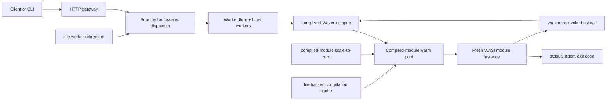

# Architecture

`wasmdee` is a single Go binary with a Cobra CLI at `cmd/wasmdee`.

For a code-path-level walkthrough and diagrams, see `docs/tracing.md`.

The current MVP keeps the repository intentionally small:

- `cmd/wasmdee` for the CLI entrypoint and subcommands
- `internal/runtime` for Wazero/WASI compilation and invocation
- `internal/state` for the SQLite-backed function registry
- `internal/config` for cross-platform app, cache, module, and log paths
- `go.mod` for the single-module layout
- `Makefile` and `.github/workflows/ci.yml` for local and CI builds
- `docs/` and `examples/hello/` for the first user-facing material

## Phase 1 runtime path

1. `wasmdee deploy <file.wasm>` hashes the module, copies it into the content-addressed module store, compiles it through Wazero to validate it, and writes a function record to SQLite.
2. `wasmdee invoke <name>` loads the function record, passes `--data` as stdin and repeated `--arg` values as argv, runs the module as a WASI command, and streams stdout/stderr back to the caller.
3. `wasmdee serve` exposes `GET /functions`, `GET /healthz`, `GET /runtime`, and `POST /invoke/{name}` using the same invocation path. Repeated `?arg=value` query params map to argv.

## Phase 2 runtime path

`wasmdee serve` now creates one long-lived Wazero engine per process. The engine instantiates WASI once, compiles each deployed function once per process, and keeps compiled modules in memory while also using Wazero's file-backed compilation cache. Each invocation still receives a fresh module instance, preserving Wasm linear-memory isolation.

HTTP invocation goes through a bounded dispatcher:

1. Request reaches `POST /invoke/{name}`.
2. The gateway reads the request body and resolves function metadata from SQLite.
3. The dispatcher admits the invocation only if queue capacity is available.
4. A worker executes the function through the shared engine.
5. If the queue is full, the gateway returns `429 Too Many Requests`.

This is the production bridge toward proto-faaslets: compiled code and host runtime state are shared now; memory snapshotting and clone/reset semantics come next.

## Phase 3 runtime path

`wasmdee serve` preloads deployed functions by default. Preloading compiles every registered module into the shared engine before the node starts accepting traffic. A bad module does not prevent the gateway from starting; failures are reported in startup output and `GET /runtime`.

The dispatcher now records per-function telemetry:

- accepted invocations
- rejected invocations
- started and completed invocations
- failed invocations
- in-flight invocations
- EWMA latency
- EWMA arrival rate
- last invocation timestamp and last error

This is intentionally not a replacement for snapshots. It is the measurement layer needed before snapshots. A proto-faaslet policy needs to know which functions are hot, which functions are slow to instantiate, and which functions are worth keeping in a template/warm state.

## Phase 4 runtime path

The node now has a first autoscaling and scale-to-zero layer:

1. `serve --min-workers N --max-workers M` keeps a small worker floor and grows workers when queue pressure appears.
2. Extra workers retire after `--scale-down-after` if they are idle.
3. `--scale-to-zero-after` evicts idle compiled modules from the in-process warm pool.
4. A later invocation rehydrates the compiled module through Wazero's file-backed compilation cache.
5. `wasmdee bench` records cold, rehydrate, and warm histograms for local Wasm modules and can also benchmark any HTTP endpoint for OpenFaaS/Docker comparison.
6. The engine exposes an experimental `wasmdee.invoke` host import so a Wasm module can call another deployed function in the same process without HTTP.

This is not snapshot/CoW restore yet. The default module contract is still WASI command-style, where instantiating the module runs `_start`. Pooling a command instance after it has exited would be unsafe and surprising. The runtime now records proto-faaslet templates and can pre-instantiate modules that expose the experimental `wasmdee_handle` handler ABI, but normal user traffic still follows the stable fresh WASI instance path until the handler SDK and request ABI are complete.

## Direction Check

The architecture is intentionally moving away from the OpenFaaS-style hot path where functions are packaged as container images and invoked through a gateway/provider/container boundary. That model is excellent for Kubernetes-native portability, but it preserves container startup, image distribution, pod scheduling, and network proxy costs in the system design.

The wasmdee runtime direction is closer to Faasm's core insight: a node should pay runtime overhead once, then run many isolated Wasm function instances inside the same host process. In the current implementation, the shared pieces are:

- Wazero runtime process
- WASI host imports
- compiled Wasm modules
- bounded autoscaled dispatcher workers
- local SQLite registry and content-addressed module store

The isolated per-request pieces are:

- Wasm module instance
- linear memory
- stdin/stdout/stderr buffers
- argv and invocation context

This split is desirable because it keeps the security and cleanup model simple while removing the most obvious repeat work from the hot path. It is also explainable for open-source contributors: compiled code is shared, execution state is not.

## Research Features and Trade-offs

| feature | current status | trade-off |
|---|---|---|
| compiled-module warm pool | implemented | removes repeat decode/compile work without sharing mutable memory |
| autoscaling workers | implemented | scales local concurrency, not cluster-wide replicas |
| scale-to-zero | implemented for compiled modules | frees warm compiled modules, but not equivalent to container replica scale-to-zero |
| benchmark proof | implemented as a CLI harness | results still depend on controlled baseline setup |
| proto-faaslet template store | implemented | records compiled templates, ABI, pool eligibility, and pool size; not a memory snapshot |
| handler-ABI instance pool | initial | pre-instantiates modules exporting `wasmdee_handle`; not yet the default request path |
| in-process function-to-function host calls | initial ABI implemented | needs SDK examples, call-chain limits, tracing, and policy hardening |
| proto-faaslet snapshots | planned | Wazero does not currently expose true page-level CoW restore as a public abstraction |
| lazy page restore/fork template | research track | may require lower-level runtime memory control, process templates, or a Wasmtime/native experiment |

The honest message for the project is: wasmdee already removes container packaging from the local hot path and proves shared compilation, autoscaled dispatch, scale-to-zero rehydration, an initial proto-faaslet template store, handler-ABI pool scaffolding, and an initial in-process call ABI. The Faasm/Catalyzer/Nightcore/SAND-style snapshot claims become valid only after the handler SDK, hardened direct local calls, snapshot mechanics, and benchmark suite are all merged.

## Contributor Boundaries

Keep these boundaries stable unless there is a strong reason to change them:

- `internal/state` owns durable local metadata.
- `internal/runtime` owns Wasm compilation, instantiation, scheduling, and invocation results.
- `internal/cli` owns user-facing commands and HTTP gateway wiring.
- `gui` should consume stable CLI/runtime APIs instead of duplicating runtime logic.

## GUI Roadmap

The GUI currently behaves as a polished dashboard shell. It should become runtime-live in stages:

1. Read-only local status: list deployed functions and show engine/dispatcher counters. Done.
2. Local invocation: call a selected function with body and argv inputs. Done.
3. Deployment workflow: pick a `.wasm`, set a function name, and call the same deploy path as the CLI. Done.
4. Observability: stream invocation history, errors, and latency percentiles once the runtime records them.

Do not let the GUI become a second control plane. It should stay a client over the same local runtime surface that the CLI and HTTP gateway use.

The desktop app owns an embedded local engine and dispatcher for interactive use. It imports the same `internal/state`, `internal/deploy`, and `internal/runtime` packages as the CLI, so deploy and invoke semantics stay aligned.

## Next Runtime Milestone

The next meaningful runtime layer is turning the initial proto-faaslet scaffolding into the default handler hot path:

1. Define the `wasmdee_handle` request/response ABI and SDK examples.
2. Route handler-ABI functions through pooled instances with reset policy.
3. Maintain a per-function warm-instance/template policy from telemetry.
4. Track local call chains so same-host functions can stay in-process with limits and tracing.
5. Only after the hot path is measured, introduce memory snapshot/reset mechanics.
6. Add benchmark fixtures against the container/OpenFaaS-style baseline.
7. Publish raw JSON benchmark artifacts and environment metadata with every performance claim.
