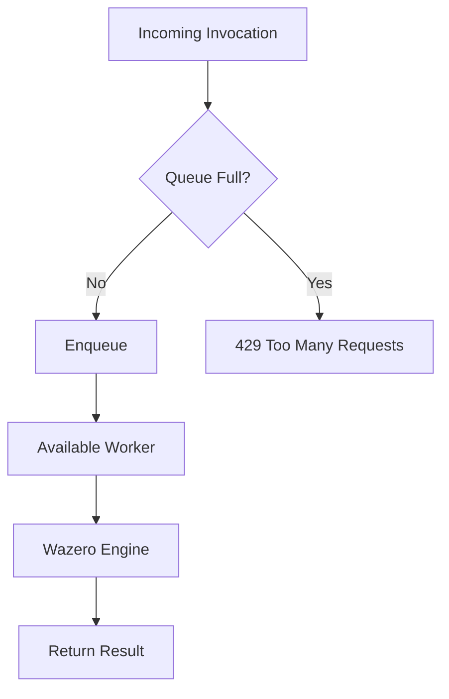

## Overview

The dispatcher sits between the HTTP gateway and the Wazero engine. It manages a pool of workers, admits invocations through a bounded queue, and provides backpressure when the system is saturated.

---

## Worker Autoscaling

The dispatcher supports three modes:

### Fixed Workers

When only `--workers` is set (and min/max are both 0), the dispatcher runs a fixed pool.

### Autoscaling Workers

When `--min-workers` and `--max-workers` are set:

1. Starts with `min-workers` active
2. Monitors queue pressure
3. Scales up toward `max-workers` under load
4. Retires idle workers after `--scale-down-after`
5. Never drops below `min-workers`

### Scale Events

| Event | Trigger |
|---|---|
| Scale up | Queue has pending work, current workers < max |
| Scale down | Worker idle > `scale-down-after`, current workers > min |

---

## Queue Admission

The queue is bounded by `--queue-size`. When full:

- New invocations receive `ErrQueueFull`
- HTTP clients get `429 Too Many Requests`
- The dispatcher does NOT block or grow unboundedly

This prevents memory exhaustion and keeps latency predictable for already-admitted work.

---

## Invocation Flow

1. **Submit** — the gateway calls `dispatcher.Submit(ctx, invocation)`
2. **Admit** — if queue has capacity, invocation is enqueued
3. **Dispatch** — a worker dequeues and calls `engine.Invoke()`
4. **Execute** — fresh module instance runs with WASI
5. **Complete** — result (stdout, stderr, exit code, latency) returned to caller

Each step respects the context deadline. If the invocation times out, the Wasm execution is cancelled through context cancellation.

---

## Dispatcher Stats

| Metric | Description |
|---|---|
| `workers` | Currently active workers |
| `min_workers` | Configured minimum |
| `max_workers` | Configured maximum |
| `accepted` | Total invocations admitted |
| `rejected` | Total invocations rejected (queue full) |
| `scale_ups` | Times new workers were spawned |
| `scale_downs` | Times idle workers retired |

Available at `GET /healthz` and `GET /runtime`.

---

## Tuning Guidelines

| Scenario | Recommendation |
|---|---|
| Low-latency, few functions | `--min-workers 4 --max-workers 16` |
| Bursty traffic | `--min-workers 2 --max-workers 64 --queue-size 2048` |
| Memory-constrained | `--min-workers 1 --max-workers 4 --scale-down-after 10s` |
| Development/testing | Defaults are fine (auto-sized to CPU count) |
