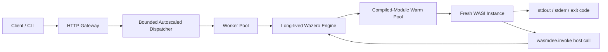

## System Design

wasmdee is a single Go binary with a Cobra CLI at `cmd/wasmdee`. The architecture follows Faasm's core insight: **pay runtime overhead once, then run many isolated Wasm function instances inside the same host process.**



---

## Package Structure

| Package | Responsibility |
|---|---|
| `cmd/wasmdee` | CLI entrypoint and subcommand registration |
| `internal/runtime` | Wazero engine, compilation, instantiation, dispatcher, invocation |
| `internal/state` | SQLite-backed function registry |
| `internal/deploy` | Deployment pipeline: hash, store, validate, register |
| `internal/config` | Cross-platform paths for app state, cache, modules, logs |
| `gui/` | Wails desktop app with React frontend |

---

## Shared vs. Isolated

The security and performance model comes from a clear split:

### Shared (per-process, amortized)

- Wazero runtime
- WASI host imports
- Compiled Wasm modules (immutable)
- Dispatcher worker threads
- SQLite registry and content-addressed module store

### Isolated (per-invocation, fresh)

- Wasm module instance
- Linear memory (zero'd on each invocation)
- stdin / stdout / stderr buffers
- argv and invocation context

This split removes the most expensive repeated work (compilation, runtime init) while keeping execution state strictly isolated.

---

## Data Flow

### Deploy

```
.wasm file → SHA-256 hash → copy to module store → Wazero compile (validate) → SQLite record
```

### Invoke (CLI)

```
function name → SQLite lookup → load compiled module → fresh instance → WASI _start → capture output
```

### Invoke (HTTP)

```
POST /invoke/{name} → request body → dispatcher queue → worker → shared engine → fresh instance → JSON response
```

---

## Design Principles

1. **Single binary** — no Docker, no sidecar, no orchestrator required
2. **Pure Go** — Wazero is a zero-dependency Wasm runtime; no CGo, no native libraries
3. **Local-first** — state is SQLite + filesystem; no external services for core operation
4. **Deny-by-default** — functions cannot access network, filesystem, or KV unless declared
5. **Measure before claiming** — performance assertions require benchmark evidence
