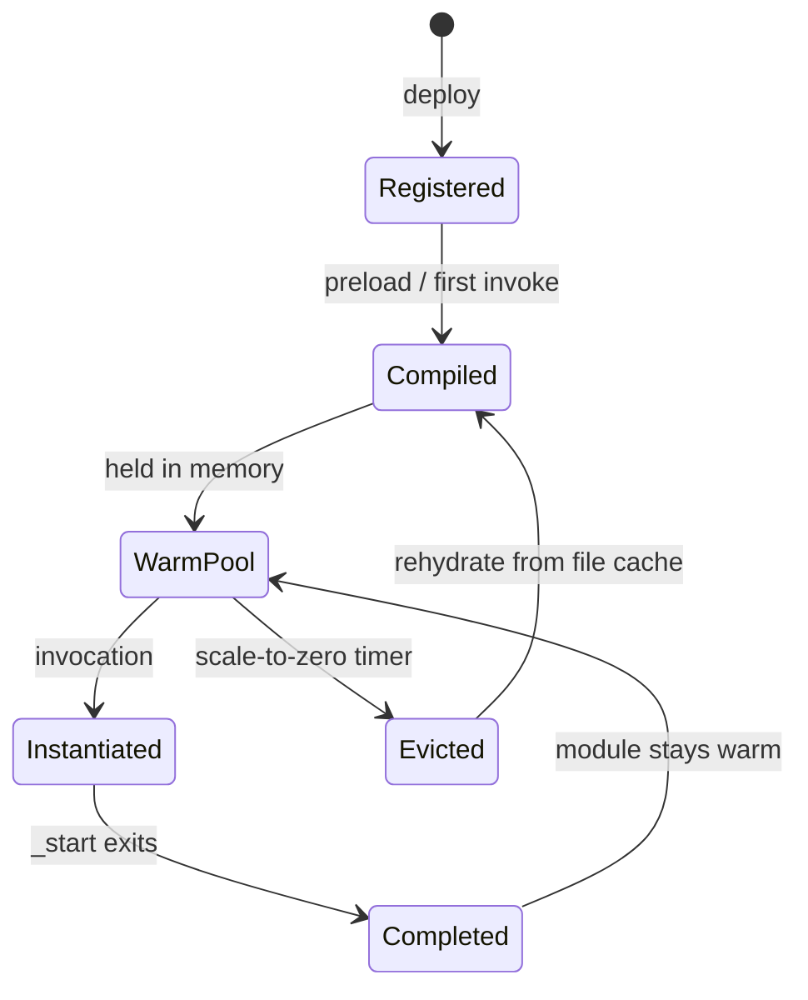

## Engine Architecture

The wasmdee runtime is built on [Wazero](https://wazero.io) — a pure-Go WebAssembly runtime with zero dependencies. A single engine instance lives for the lifetime of the `wasmdee serve` process.



---

## Compilation Layers

wasmdee uses two compilation cache layers:

### In-Memory Warm Pool

Compiled modules are held in process memory. A warm invocation skips module compilation, but still creates fresh execution state for the WASI command. Measure the resulting latency with `wasmdee bench` instead of treating a particular threshold as guaranteed.

### File-Backed Compilation Cache

Wazero's built-in compilation cache stores compiled artifacts on disk. When a module is evicted from the warm pool (scale-to-zero), the next invocation reloads from this file cache instead of recompiling from the raw `.wasm` bytes.

| Path | Cost |
|---|---|
| Cold (no cache) | Full compilation from `.wasm` bytes |
| Rehydrate (file cache) | Load pre-compiled artifact from disk |
| Warm (memory) | Instantiate already-compiled module |

---

## Preloading

By default, `wasmdee serve` considers deployed functions for startup preload:

1. Queries all registered functions from SQLite
2. Skips functions whose deployment policy sets `preload: false`
3. Compiles remaining `.wasm` modules into the warm pool
4. Reports compiled, skipped, and failed counts at startup

A failed preload does not prevent the gateway from starting. Failed modules are reported in stdout and available via `GET /runtime`.

---

## Scale-to-Zero

When `--scale-to-zero-after` is configured, idle compiled modules are evicted from the in-memory warm pool:

- The engine tracks the last invocation time per module
- A background sweep evicts modules idle longer than the threshold
- The file-backed compilation cache is preserved
- Next invocation rehydrates from the file cache (not a full cold compile)

This lets the process release memory for functions that aren't being called while maintaining fast rehydration.

---

## Host Calls (Experimental)

The engine exposes a `wasmdee.invoke` host import, allowing a Wasm module to call another deployed function in the same process without going through HTTP:

```
module A → wasmdee.invoke("module-b", payload) → engine → module B → result back to A
```

This initial ABI has call-cycle and depth limits. It still needs distributed tracing, authorization policy, and language SDKs before production use.

---

## Engine Stats

The engine tracks:

| Metric | Description |
|---|---|
| `compiled_modules` | Currently warm compiled modules |
| `compile_requests` | Total compilation attempts |
| `compile_hits` | Served from warm pool (no recompile) |
| `evictions` | Modules evicted by scale-to-zero |
| `invocations` | Total function executions |
| `host_calls` | In-process function-to-function calls |
| `host_call_failures` | Failed host calls |

Available at `GET /runtime` when the gateway is running.
