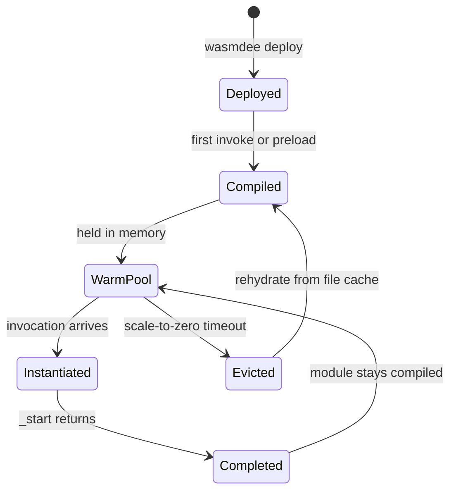

## Runtime Model

wasmdee runs a single long-lived WebAssembly runtime (powered by [Wazero](https://wazero.io)) per process. Functions are compiled once and stored as in-memory compiled modules. Each invocation gets a **fresh module instance** with its own linear memory, preserving isolation without the overhead of container startup.

```
HTTP request
    → bounded dispatcher queue
        → worker picks up invocation
            → compiled module instantiated (fresh linear memory)
                → WASI _start runs with stdin/stdout/argv
                    → stdout captured as response
```

---

## Function Contract

Today, wasmdee runs **WASI command modules**:

| Input | Mechanism |
|---|---|
| Request body | Delivered via **stdin** |
| Arguments | Delivered via **argv** (CLI `--arg` or HTTP `?arg=`) |

| Output | Mechanism |
|---|---|
| Response | Read from **stdout** |
| Errors/logs | Read from **stderr** |
| Status | WASI exit code (0 = success) |

This is the simplest and most portable contract — it works with any language that targets `wasm32-wasi`.

---

## Isolation Guarantees

Each invocation is isolated at the Wasm level:

- **Linear memory** — fresh allocation per instance, zero'd on start
- **File system** — no access unless explicitly granted in capabilities
- **Network** — no access unless explicitly granted
- **Other functions** — no shared state between invocations

What is **shared** across invocations (for performance):

- The Wazero runtime process
- WASI host imports (read-only)
- Compiled module bytes (immutable)
- Dispatcher worker threads

---

## Module Lifecycle



- **Cold** — fresh engine + fresh compile (first-ever invocation)
- **Rehydrate** — existing engine + reload from file-backed compilation cache
- **Warm** — existing engine + already-compiled module in memory

---

## Capabilities

Each function can declare what system access it needs in a `wasmdee.toml`:

```toml
[function]
name = "my-function"

[capabilities]
network = false
kv = false
fs = []
```

Everything not listed is denied at the host import layer. This follows a **deny-by-default** model.

---

## How wasmdee differs

### vs. Container-based FaaS (OpenFaaS, AWS Lambda)

Container platforms package each function as a Docker image. Invocations require container scheduling, image pull, process init, and network proxy. wasmdee runs all functions in a single process with Wasm isolation — no image, no container, no scheduling.

### vs. Faasm

[Faasm](https://github.com/faasm/faasm) pioneered shared-nothing Wasm isolation with proto-faaslets, memory snapshots, and state tiers. wasmdee is moving in the same architectural direction but starts from a simpler foundation: pure-Go runtime (Wazero), WASI command modules, and local-first operation. Proto-faaslet templates and snapshot/CoW are research milestones.

### vs. Cloudflare Workers

Workers run V8 isolates at the edge with a JavaScript/Wasm runtime. wasmdee is self-hosted, runs any WASI-targeting language, and is designed for local or private-cloud deployment without a vendor runtime.
