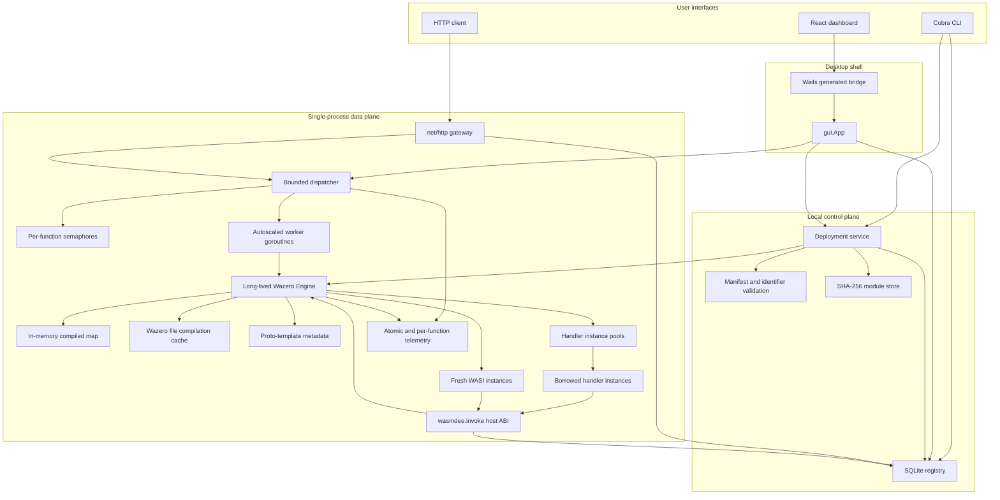
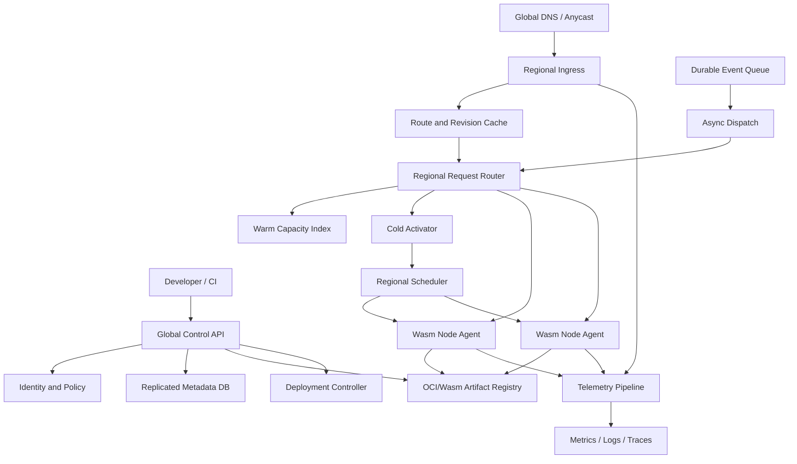
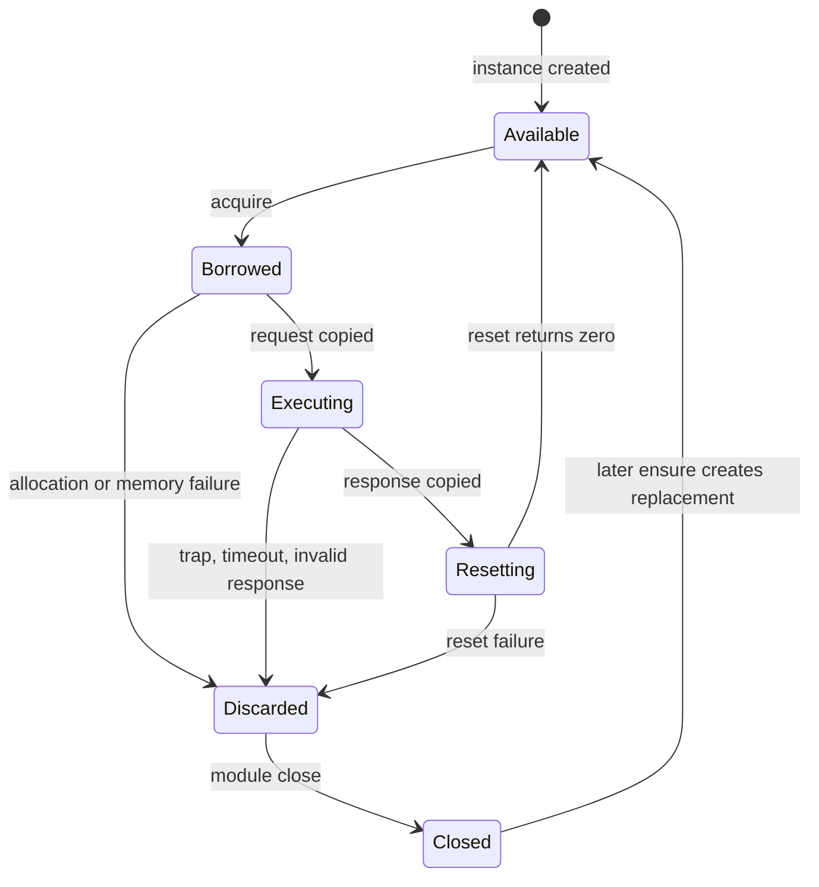

# wasmdee Technical Interview Defense

This document explains the repository as it exists in the current working tree.
It deliberately separates implemented behavior from research direction. That
distinction is essential in a senior technical interview: a strong defense is
not the largest claim; it is the most precise claim that survives source-code,
failure-mode, and benchmark scrutiny.

## How To Use This Document

- Read Sections 1 through 7 to learn the system from problem to implementation.
- Use Section 5 to practice tracing a request without skipping a function.
- Use Section 9 as a mock interview bank.
- Use Section 10 to volunteer limitations before an interviewer discovers them.
- Use Section 11 to calibrate resume claims.
- Use Sections 12 and 13 for senior system-design and runtime grilling.
- Source references use the current file and line ranges as orientation points.
  The code remains the authority if line numbers move.

# 1. Problem Statement

## 1.1 What Problem Does wasmdee Solve?

wasmdee is a local-first, single-node Function-as-a-Service runtime for
WebAssembly. It solves five connected engineering problems:

1. **Function packaging without a container image.** A function is deployed as a
   `.wasm` module rather than an OCI image. The deploy path hashes the raw module,
   stores it by SHA-256 digest, validates it by compiling it with Wazero, and
   records routing and policy metadata in SQLite.
2. **Avoiding repeated runtime and compilation setup.** A long-lived `Engine`
   owns one Wazero runtime, one file-backed compilation cache, an in-memory
   compiled-module map, host imports, and reusable handler instance pools.
3. **Controlling overload.** A bounded dispatcher admits only a finite number of
   pending invocations, rejects excess work immediately, and scales local worker
   goroutines between configured minimum and maximum values.
4. **Supporting both conservative isolation and faster reuse.** Conventional
   WASI command modules receive a fresh instance for each invocation. Modules
   that implement wasmdee's stricter handler ABI can reuse pre-instantiated
   instances after an explicit reset contract succeeds.
5. **Making runtime behavior observable and measurable.** The gateway and GUI
   expose engine, dispatcher, preload, pool, and per-function telemetry. The
   benchmark command separates cold, rehydrate, and warm execution paths.

The project is therefore not merely "run a Wasm file." It is an experiment in
the shape of a Wasm-native serverless node: deployment metadata, admission,
scheduling, execution, warm-state lifecycle, local service calls, telemetry,
and reproducible comparison.

## 1.2 Why Is the Problem Important?

Traditional FaaS systems often place several layers between source code and
execution:

```text
source -> dependency bundle -> container image -> registry -> scheduler
       -> image pull -> container/process/runtime init -> request proxy
       -> function handler
```

Those layers provide real benefits, particularly ecosystem compatibility,
operational tooling, and strong isolation. They also create costs:

- image build and distribution overhead;
- per-replica operating-system and process state;
- cold initialization latency;
- network hops between colocated functions;
- orchestration complexity for small local or edge deployments;
- coarse resource units when the function itself is tiny.

WebAssembly offers a different package and isolation unit. A `.wasm` module is
portable bytecode with bounded linear memory and explicit imports. An embedded
runtime can share immutable compiled code while creating isolated execution
state per request. wasmdee explores that design in understandable Go code rather
than hiding it inside a managed platform.

The educational importance is also substantial. The repository makes normally
opaque FaaS concerns visible:

- what "cold," "warm," and "scale-to-zero" actually mean;
- where backpressure belongs;
- how mutable state affects instance reuse;
- why compilation reuse is not the same as snapshot restoration;
- how direct service invocation changes authorization and recursion risks;
- why benchmark methodology matters as much as benchmark output.

## 1.3 Existing Solutions and Their Limitations

### Containers and Kubernetes-Based FaaS

Platforms such as OpenFaaS package workloads as container images and commonly
run each function replica as a Kubernetes Pod. This gives broad language and
native-library compatibility, mature image distribution, namespaces, cgroups,
rolling deployment, service discovery, and cluster scheduling.

For wasmdee's research goal, the limitations are:

- the artifact includes more than function logic;
- startup can include image and process work;
- the unit of scaling is normally a Pod or container;
- a small local prototype inherits a large control-plane surface;
- local function-to-function calls typically traverse a proxy or network stack.

wasmdee does not replace those production capabilities. It removes them from
the single-node experiment so the execution substrate can be studied directly.

### AWS Lambda and Firecracker

AWS Lambda is a complete managed service with event integrations, global
capacity management, IAM, billing, retries, deployment versions, observability,
and isolated execution environments. Firecracker provides a KVM-backed microVM
boundary designed for multi-tenant serverless workloads.

wasmdee has a much smaller startup and operational surface, but its in-process
Wasm sandbox is not equivalent to a microVM security boundary. It has no
account-level tenancy, IAM, durable event system, regional scheduler, managed
networking, or service-level objective.

### Cloudflare Workers

Workers amortizes a V8 runtime across many lightweight isolates distributed over
Cloudflare's edge. This is philosophically close to wasmdee's "pay for the host
runtime once, create lightweight isolated execution contexts" direction.

Workers is globally operated, deeply integrated with an edge network and web
APIs, and primarily built around V8 isolates. wasmdee is self-hosted, local,
WASI-oriented, and implemented with Wazero. It is much easier to inspect, but
vastly less mature operationally and security-wise.

### Fermyon Spin

Spin is the closest product-level comparison. It runs event-driven applications
as Wasm components, supports HTTP and other triggers, uses WIT/component-model
interfaces, includes language SDKs and capability APIs, and supports private
in-process service chaining.

wasmdee currently has a simpler custom handler ABI and a compatibility-oriented
WASI command path. This lowers implementation complexity and makes memory
transfer explicit, but sacrifices the typed interfaces, composition, ecosystem,
and standards alignment of the component model.

### wasmCloud

wasmCloud is a distributed application platform around WebAssembly components,
capability providers, NATS-based control and RPC, interchangeable hosts, and
zero-trust linking. It already addresses the multi-node and capability-model
problems that wasmdee leaves for future work.

wasmdee is intentionally a smaller node-runtime study. Its advantage is that the
entire request path fits in one repository and process. Its limitation is that
it lacks wasmCloud's lattice, provider model, declarative distributed
application management, and mature observability.

## 1.4 The Precise Project Claim

A defensible one-sentence claim is:

> wasmdee is a single-node Wasm FaaS prototype that combines
> content-addressed deployment, SQLite route metadata, bounded autoscaling
> dispatch, a long-lived Wazero engine, fresh WASI execution, reusable
> reset-based handler pools, local direct calls, scale-to-zero rehydration,
> telemetry, a desktop console, and reproducible benchmark tooling.

Do not claim:

- production multi-tenant isolation;
- cluster-wide autoscaling;
- real external URL provisioning;
- page-level snapshots or copy-on-write restoration;
- proven performance superiority without generated benchmark artifacts;
- arbitrary WASI capability grants;
- exactly-once execution.

# 2. High-Level Architecture

## 2.1 Complete System Architecture



## 2.2 Major Components

### CLI and Process Bootstrap

`cmd/wasmdee/main.go` does one thing: call `cli.Execute()`. The root command in
`internal/cli/root.go` creates a signal-aware context, initializes directories,
configures the process-wide SQLite path, and registers `deploy`, `invoke`,
`list`, `serve`, and `bench`.

Why it exists:

- centralizes command lifecycle and cancellation;
- gives every command the same state directory and DB configuration;
- keeps the executable entrypoint free of domain logic.

Trade-off:

- Cobra command variables and flags are package globals, which are convenient
  for a CLI but harder to test in parallel or embed multiple times in-process.

### Deployment Control Plane

`internal/deploy` validates manifests and identifiers, calculates the module
digest, stores the module, validates compilation, and upserts the registry row.

Why it exists separately from CLI:

- both the CLI and Wails GUI call the same deployment service;
- policy and persistence semantics cannot silently diverge by interface.

### SQLite Registry

`internal/state/db.go` stores a function's logical name, local module path,
serialized policy, route, public URL metadata, application name, deployment
name, domain, and timestamp.

Why SQLite:

- transactional upsert;
- durable local metadata;
- no external service;
- easy route and name lookup;
- appropriate for a single-node prototype.

Trade-off:

- process-global DB state;
- no distributed consistency;
- no uniqueness constraint on `route`;
- schema migration is an ad hoc `PRAGMA` plus `ALTER TABLE`, not versioned.

### HTTP Gateway

`internal/cli/serve.go` owns HTTP concerns:

- route registration;
- request-body limiting;
- name or route resolution;
- conversion to `runtime.Invocation`;
- error-to-status mapping;
- JSON serialization;
- server timeouts and graceful shutdown.

It deliberately does not compile or invoke Wasm directly. That boundary keeps
transport policy out of the runtime.

### Dispatcher

`internal/runtime/dispatcher.go` is the admission and scheduling boundary:

- bounded buffered channel;
- non-blocking rejection on saturation;
- per-function concurrency semaphores;
- worker goroutines;
- scale-up based on queued work relative to active workers;
- scale-down using worker idle timers;
- per-function telemetry hooks.

### Engine

`internal/runtime/executor.go` owns:

- Wazero runtime and compilation cache;
- WASI host module;
- custom `wasmdee.invoke` host module;
- compiled module map;
- ABI selection;
- invocation timeouts and nested-call stack;
- fresh WASI instantiation;
- handler pool invocation;
- idle eviction;
- runtime counters.

### Proto Store and Instance Pools

`internal/runtime/proto_store.go` contains two distinct concepts:

1. `protoStore`: metadata describing compiled templates and whether they are
   eligible for pooling.
2. `instancePoolStore`: live reusable handler modules, keyed by Wasm path.

The name "proto-faaslet" must be defended carefully. The current object is not a
memory snapshot. For WASI commands it is compiled-module metadata. For handler
modules, the runtime also maintains live pre-instantiated instances.

### Telemetry

There are two metric styles:

- `atomic.Uint64` and `atomic.Int64` counters for engine and dispatcher totals;
- mutex-protected per-function telemetry with EWMA latency and arrival rate.

This is in-memory observability. It resets with the process and is not yet an
OpenTelemetry pipeline.

### Desktop GUI

The Wails application is an embedded client of the same Go packages:

- `gui/app.go` starts an `Engine` and `Dispatcher`;
- generated Wails bindings expose methods to React;
- the frontend polls snapshots every three seconds;
- deployment uses a native file picker;
- invocation uses the shared dispatcher;
- optional Supabase authentication wraps the local console.

## 2.3 Request Lifecycle at a Glance

For `POST /echo`:

1. `net/http` matches `POST /`.
2. `routeInvokeHandler` looks up `/echo` in SQLite.
3. `invokeFunction` applies `MaxBytesReader` and reads the body.
4. `Dispatcher.Submit` applies the default timeout if none is set.
5. The dispatcher acquires the function's concurrency slot.
6. A non-blocking send attempts to enqueue the job.
7. `maybeScaleUp` may spawn a worker.
8. A worker records start telemetry and calls `Engine.Invoke`.
9. The engine detects recursion, compiles or reuses the module, and detects ABI.
10. WASI path: instantiate a fresh module with stdin/argv and capture output.
11. Handler path: ensure pool capacity, borrow, allocate, write request, call,
    copy response, reset, and either return or discard the instance.
12. The worker records completion and sends the result on a buffered response
    channel.
13. The gateway maps the result to JSON and an HTTP status.

## 2.4 Architectural Trade-Offs

### One Runtime Per Process

Benefit:

- amortizes runtime initialization and host imports;
- enables compiled-module reuse and direct in-process calls.

Cost:

- a process crash affects all functions on that node;
- all tenants share one host process;
- runtime-level memory pressure is a shared fate;
- stronger isolation needs another boundary.

### Fresh WASI Instances

Benefit:

- simple cleanup;
- fresh linear memory;
- no cooperative reset requirement;
- standard command-style compatibility.

Cost:

- instantiation on every request;
- command ABI loses structured HTTP metadata;
- `_start` is not naturally a reusable handler.

### Reusable Handler Instances

Benefit:

- avoids repeated instantiation;
- bounded pool provides predictable maximum live instances;
- direct byte transfer is simple and language-neutral.

Cost:

- correctness depends on guest `wasmdee_reset`;
- no runtime proof that all state was cleared;
- custom ABI and SDK burden;
- no streaming response;
- request and response copies remain.

### SQLite and Filesystem State

Benefit:

- local, inspectable, transactional, zero external infrastructure.

Cost:

- single-node only;
- no replication, leader election, or distributed route convergence;
- module garbage collection is missing.

### Bounded Queue With Immediate Rejection

Benefit:

- memory usage does not grow without bound;
- overload is explicit;
- admitted requests avoid an infinitely growing wait.

Cost:

- no priority, fairness, retries, or durable queue;
- a single FIFO queue can allow noisy-neighbor effects;
- rejection policy is not adaptive.

# 3. Repository Walkthrough

## 3.1 Root Files

### `go.mod` and `go.sum`

The root Go module targets Go 1.25 and has four direct runtime dependencies:

- Cobra for CLI structure;
- Wazero for pure-Go Wasm compilation and execution;
- YAML v3 for strict manifest parsing;
- modernc SQLite for a CGo-free embedded registry.

The pure-Go SQLite choice aligns with the pure-Go Wazero goal and simplifies
cross-platform builds. The cost is a larger Go dependency graph than using
platform SQLite through CGo.

### `Makefile`

Important targets:

- `build`: produces `bin/wasmdee`;
- `demo-fixture`: regenerates the handler Wasm;
- `fmt`: formats Go sources;
- `test`: runs root, tool, and Docker baseline package tests;
- `verify`: checks formatting, tests packages, regenerates and byte-compares the
  fixture, and builds the CLI;
- `clean`: removes `bin`.

The fixture comparison is valuable because `examples/handler/echo.wasm` is a
binary artifact. CI proves that it matches the source generator.

### `.github/workflows/ci.yml`

The runtime job verifies formatting, root tests, tool tests, Docker baseline
source, fixture reproducibility, race detection, and CLI build. The GUI job uses
Node 22, runs frontend unit tests and production build, then tests the Wails Go
package.

Missing CI checks:

- `go vet`;
- staticcheck/golangci-lint;
- vulnerability scanning;
- end-to-end HTTP smoke test;
- Windows and macOS builds;
- benchmark regression thresholds;
- Wails packaged application build.

### `.gitignore`

Keeps generated or local artifacts out of version control. In an interview,
check it before claiming reproducible outputs are committed; benchmark result
directories may intentionally be ignored.

### `LICENSE`

Apache License 2.0. This is compatible with the project's open-source systems
orientation and provides explicit patent terms.

## 3.2 `cmd/wasmdee`

### `cmd/wasmdee/main.go`

This nine-line file is the executable composition root. Its lack of logic is a
positive architectural property: command behavior remains testable and reusable
inside `internal/cli`.

## 3.3 `internal/config`

### `internal/config/paths.go`

Responsibilities:

- resolve `WASMDEE_HOME`;
- provide OS-specific default base paths;
- derive state, module, cache, log, and runtime directories;
- normalize paths;
- create required directories.

macOS uses `~/Library/Application Support/Wasmdee`; Windows uses `%APPDATA%`;
Linux uses `XDG_CONFIG_HOME` or `~/.config`. `WASMDEE_HOME` is especially useful
for isolated tests and demos.

Important weakness: documentation says Linux defaults may use
`~/.local/share`, while code uses `~/.config`. Interviewers may use this to test
whether you trust docs or source. Source wins; the docs should be corrected.

Security concern: directories are created with `0755`, and stored modules with
`0644`. That is acceptable for a single-user developer tool but too permissive
for secrets or shared-host multi-tenancy.

## 3.4 `internal/state`

### `internal/state/db.go`

The package uses process-global state:

```go
var (
    db *sql.DB
    dbMu sync.Mutex
    dbPath string
    configured bool
)
```

`Configure` sets the DB path. `GetDB` lazily initializes. `initDB` creates the
base table and adds later columns if missing. `SaveFunction` uses a transaction
and `ON CONFLICT(name) DO UPDATE`.

Data model:

- `Name`: logical primary key;
- `WasmPath`: content-addressed local artifact path;
- `Capabilities`: JSON envelope currently used for deployment controls;
- `Route`: gateway route;
- `PublicURL`, `Domain`: metadata only;
- `AppName`, `DeploymentName`: application grouping metadata;
- `CreatedAt`: Unix seconds.

`GetFunctionByRoute` assumes at most one matching row but the schema does not
enforce route uniqueness. Manifest deployment prevents duplicate routes inside
one manifest, but separate deploy operations can create collisions.

`ensureFunctionColumns` is a lightweight forward migration. It works for adding
non-null columns with defaults, but it has no migration version, rollback, or
coordination for multiple processes.

Concurrency concern: `GetDB` checks `db == nil` without holding `dbMu` before
calling `initDB`. Two goroutines can read the global concurrently with a write.
Normal startup configures and initializes before high concurrency, but the
pattern is not rigorously race-free as a reusable library.

### `internal/state/db_test.go`

Tests prove:

- registry round-trip;
- same-name replacement;
- route lookup and metadata persistence.

Missing tests:

- concurrent initialization and writes;
- schema migration from the old table;
- route collision behavior;
- invalid DB path and disk failure;
- busy/locked SQLite behavior.

## 3.5 `internal/deploy`

### `internal/deploy/validation.go`

`ValidateName` restricts names to lowercase DNS-like identifiers of 2-63
characters. `ValidateRoute` requires an absolute request path and rejects spaces,
double slashes, queries, and fragments. `ValidateDomain` accepts lowercase
hostnames, rejects trailing dots and IP addresses.

`generatedURL` either combines a custom domain and route or generates a
randomized `*.wasmdee.local` metadata URL. It does not configure DNS or TLS.

### `internal/deploy/manifest.go`

The YAML decoder uses `KnownFields(true)`, which is a strong configuration
choice: misspelled controls fail instead of being silently ignored.

`LoadManifest`:

- resolves and reads the file;
- defaults version zero to version one;
- validates app and domain;
- requires functions;
- enforces unique names and routes within the manifest;
- defaults routes to `/<function>`;
- validates source extension and controls.

`FunctionControls` stores:

- optional `preload`;
- `max_concurrency`, where zero means unlimited;
- `scale_to_zero_after`.

`Application` deploys enabled functions sequentially. This gives simple error
reporting but no atomic all-or-nothing application deployment. If function three
fails, functions one and two remain deployed.

### `internal/deploy/deploy.go`

The exact pipeline is:

1. resolve source path;
2. require `.wasm`;
3. require module and cache directories;
4. open source;
5. stream bytes through SHA-256;
6. rewind;
7. create module directory;
8. write `<digest>.wasm`;
9. validate through Wazero;
10. derive and validate function/app names;
11. default and validate route;
12. validate domain;
13. serialize controls into `Capabilities`;
14. generate optional URL metadata;
15. upsert SQLite record.

Two subtle limitations:

- `O_TRUNC` rewrites an identical content-addressed file instead of detecting it
  already exists and reusing it.
- validation occurs after the artifact is written. On validation failure the
  file is removed, but if another deployment references the same digest, removal
  could affect it. In practice valid identical content would not fail validation,
  but atomic temp-file plus rename/reference tracking would be stronger.

Critical source defect: `ValidateModule` currently calls `Compile` but returns
`nil` regardless of the compile error. This means deploy-time validation does
not actually reject malformed Wasm as intended. The runtime will reject it on
preload or invocation. This is a real weakness, not a documentation nuance.

### `internal/deploy/manifest_test.go`

Tests cover default routes, explicit routes, invalid names/routes, negative
concurrency, and unknown controls. Deployment I/O, digest behavior, invalid Wasm
rejection, and partial manifest failure are not covered.

## 3.6 `internal/cli`

### `root.go`

Creates a signal-cancelled root context, initializes directories and DB path in
`PersistentPreRunE`, and exits non-zero on command errors.

One issue: the global `verbose` flag is never passed to
`utils.SetVerbose(verbose)`, so file debug logging is effectively disconnected
from the CLI flag. `serve.go` and `invoke.go` read the `verbose` variable
directly, but `utils.Debug` remains disabled.

### `deploy.go`

Supports one `.wasm` positional deployment or a YAML manifest, with mutual
exclusion enforced in `Args`. A 20-second context bounds deployment.

Single-file deploy cannot set the per-function controls exposed by the manifest.
That is acceptable UX simplification but should be stated.

### `invoke.go`

Looks up the function and calls the package-level `runtime.Invoke`, which creates
a short-lived engine for this one command. The file-backed cache remains useful,
but in-memory compiled modules and handler pools do not survive CLI invocations.

This is intentionally different from `serve` and GUI behavior. Use `serve` for
long-lived warm execution and throughput measurements.

The CLI returns a generic Cobra error when the guest exit code is non-zero. It
does not call `os.Exit` with the guest's exact code, despite an older requirement
document suggesting that behavior.

### `list.go`

Prints name, creation time, and module path. It omits route, ABI, app, policy, and
URL metadata, so it is a basic registry view rather than a full deployment
inspection command.

### `serve.go`

This is the long-lived composition root:

- builds `EngineConfig`;
- optionally preloads registry functions;
- builds `DispatcherConfig`;
- registers health, runtime, list, named invoke, and route invoke handlers;
- configures HTTP timeouts;
- listens asynchronously;
- gracefully shuts down on context cancellation.

Important details:

- default fixed workers are `NumCPU * 4`;
- setting min/max enables local worker elasticity;
- queue default is 1024;
- request, handler input, and handler output defaults are each 8 MiB;
- `POST /invoke/` is registered before catch-all `POST /`;
- the gateway maps queue and function-limit rejection to HTTP 429;
- guest non-zero exit maps to 502;
- runtime errors map to 500.

Potential improvements:

- return 413 for oversized bodies rather than generic 400;
- distinguish deadline exceeded as 504;
- add `Retry-After` for 429;
- set security headers and request IDs;
- authenticate deploy/inspect/invoke surfaces;
- avoid exposing local filesystem paths in `/functions`;
- implement structured logging and response status capture.

### `bench.go`

Local mode measures:

- **cold**: a new engine and a new temporary compilation cache per run;
- **rehydrate**: evict in-process compiled state, preserve Wazero file cache;
- **warm**: shared engine plus dispatcher, including handler pool when eligible.

HTTP mode measures generic POST round trips.

`runMeasured` uses `concurrency` goroutines and an atomic index to assign exactly
`iterations` calls. Each call stores latency in a unique array slot. Summary
sorts milliseconds and computes average, nearest-lower-index percentile, min,
max, errors, and throughput.

Methodology limitations:

- percentile calculation has no interpolation;
- errors are included in latency and throughput counts;
- HTTP mode considers 4xx responses successful, including overload 429;
- response bodies are not read, so semantic correctness is not validated and
  connection reuse may be affected;
- cold runs create temporary cache directories but never remove them;
- Go `MemStats` delta is noisy and not per-function resident memory;
- benchmark flags are package globals;
- there are no confidence intervals or repeated experiment groups.

## 3.7 `internal/runtime`

### `executor.go`

The main execution engine. Detailed in Sections 4, 5, 6, and 13.

### `dispatcher.go`

The admission and local worker scheduler. Detailed in Sections 4 and 6.

### `proto_store.go`

ABI detection, proto-template metadata, handler signature validation, and live
instance pool lifecycle. Detailed in Sections 4 and 13.

### `policy.go`

Deserializes deployment controls from `Function.Capabilities`. This is a
compatibility shortcut: policy is stored in a field originally named for
capabilities. A production schema should separate scheduling policy, capability
grants, and deployment metadata.

### `telemetry.go`

Records accepted, rejected, started, completed, failed, in-flight, EWMA latency,
arrival rate, last invocation, and last error.

Implementation/documentation mismatch: JSON field names are `avg_latency_ms` and
`arrival_rate_per_sec`, while some docs show `ewma_latency_ms` and a map-shaped
`function_stats`. Actual `/runtime` returns a sorted array.

### `executor_test.go`

This is the strongest specification of runtime behavior. It tests:

- compiled-module reuse;
- preload and policy skip;
- WASI proto metadata;
- handler pool creation and reuse;
- request bounds;
- incomplete ABI rejection;
- reset failure discard and later replenishment;
- pool wait cancellation;
- concurrent first use;
- explicit and policy-driven eviction;
- bounded queue rejection;
- nil context;
- scale-down;
- function concurrency;
- cyclic and deep calls.

Missing high-value tests:

- successful `wasmdee.invoke` host call with an importing guest;
- output-too-large and invalid-memory host statuses;
- response-size limit;
- HTTP status mapping and body limit;
- dispatcher close concurrent with submit;
- engine close concurrent with compile/invoke;
- scale-to-zero while an instance is borrowed;
- pool discard after timeout/trap;
- telemetry arrival-rate math;
- high-contention stress beyond the current fixture.

### `wasmfixture/handler.go`

Programmatically emits a tiny valid Wasm binary without an external compiler.
It defines:

- function types;
- three functions;
- memory;
- mutable bump-pointer global;
- required exports;
- allocator;
- echo handler that packs pointer and length;
- reset that restores the allocator cursor.

The byte-level helpers build WebAssembly vectors, sections, exports, and unsigned
LEB128 encodings. This fixture is valuable because it makes tests hermetic and
demonstrates understanding below an SDK abstraction.

## 3.8 `gui`

### `gui/main.go`

Embeds `frontend/dist` into the desktop binary, configures Wails window options,
and binds one `App` object.

### `gui/app.go`

At startup:

1. creates directories;
2. configures SQLite;
3. creates a long-lived engine;
4. lists functions;
5. creates a fixed dispatcher at `NumCPU * 2`;
6. preloads functions.

Methods exposed to React:

- `RuntimeSnapshot`;
- `InvokeFunction`;
- `SelectAndDeployFunction`.

The GUI uses a fixed worker pool because only `Workers` is set. It does not
configure handler size, scale-to-zero, or host call depth explicitly, so engine
defaults apply.

Concurrency weakness: Wails can call bound methods concurrently, but `preload`
and `startErr` are plain fields without a mutex. Most UI usage is sequential,
yet the struct is not designed as a rigorously concurrent service.

### `gui/app_test.go`

Runs a genuine integration path:

- temporary `WASMDEE_HOME`;
- app startup;
- deployment of the committed handler fixture;
- preload;
- invocation through the GUI bridge method;
- snapshot inspection.

This is stronger than a mocked UI test because it crosses DB, deploy, engine,
pool, dispatcher, and DTO boundaries.

### `gui/frontend`

`App.jsx` owns optional Supabase auth and theme state. If Supabase variables are
absent, the app opens directly as a local console. This makes authentication a
UI gate, not a runtime security boundary.

`dashboard-page.jsx` is the frontend orchestration layer:

- polls runtime snapshot every three seconds;
- maps backend data into rows and cards;
- deploys through the Wails file picker;
- invokes functions;
- shows toasts and switches views.

`wasmdee-runtime.js` isolates generated Wails calls and supplies a zero-data
browser preview fallback.

`runtime-view-model.js` keeps small pure presentation decisions testable:
handler versus WASI label and success-rate calculation.

`invoke-function.jsx` hides argv for handler ABI functions because the backend
rejects handler arguments. This is a good example of UI behavior derived from a
runtime contract.

`runtime-summary.jsx` displays engine, dispatcher, preload, pool, and
per-function counters.

`login-form.jsx` appears to be an unused earlier component. Removing dead UI
code would reduce confusion.

Security note: Supabase sign-in controls entry to the React dashboard, but the
local Go methods are not documented as independently authorizing calls. Do not
present this as hardened desktop access control.

## 3.9 `benchmarks`, `scripts`, `examples`, and `tools`

### `benchmarks/docker`

A two-stage Dockerfile builds a static Go HTTP echo server and copies it into a
scratch image. The server exposes `/healthz` and `/echo`, enforces the same 8 MiB
request limit, and uses comparable HTTP timeouts.

This is a useful transport baseline, not a full Docker FaaS comparison. It
measures one already-running containerized Go service, not image pull, container
creation, orchestration, per-function proxying, or scale-to-zero.

### `scripts/benchmark-compare.sh`

Automates a same-machine run:

- isolated wasmdee home;
- generated fixture;
- local binary;
- deployed handler;
- wasmdee server sized to benchmark concurrency;
- Docker echo server;
- readiness checks;
- local handler, wasmdee HTTP, and Docker HTTP reports;
- environment and runtime telemetry capture;
- cleanup trap.

This is a strong reproducibility scaffold. It still needs CPU pinning, repeated
runs, thermal stabilization, resource-limit parity, container stats, raw
response validation, and statistical analysis for publication-quality claims.

### `examples/handler`

Contains the generated echo module, manifest, and exact lifecycle explanation.
The manifest demonstrates preload, max concurrency, and per-function
scale-to-zero.

### `examples/hello`

Contains a manifest template but no `hello.wasm`. The TOML capability file is
not consumed by current code. Treat it as historical or future-facing
documentation, not an implemented configuration path.

### `tools/handler-example`

Writes the deterministic test fixture to disk. It is intentionally tiny and
depends on the internal fixture package.

## 3.10 `docs`

The key architecture documents are:

- `README.md`: product surface and status truth table;
- `docs/architecture.md`: design decisions and roadmap;
- `docs/tracing.md`: end-to-end sequence diagrams;
- `docs/handler-abi.md`: exact reusable-instance contract;
- `docs/benchmarking.md`: publishing rules;
- `docs/internship-demo.md`: defensible live demo;
- `docs/documentation`: documentation-site sources;
- `docs/diagrams`: architecture assets.

The docs are unusually careful about not claiming snapshot/CoW behavior. That
discipline should be preserved. There are several stale details, including
Linux paths, telemetry shapes, and some capability/TOML references.

## 3.11 `.kiro/specs`

The Phase 1 requirement file records the project's earlier intended shape. It
mentions an `internal/store` package, persisted compiled artifacts, invoke flags
for directory/environment capabilities, and exact guest exit-code propagation.
The current implementation evolved differently:

- raw modules live in `state/modules`;
- Wazero owns compiled cache persistence;
- capability grants are not implemented;
- invocation returns a CLI error rather than exact process exit propagation.

This is not necessarily a failure. Specifications evolve. In an interview,
explain the delta explicitly and say which requirements were deferred or
replaced.

# 4. Core Implementation Deep Dive

## 4.1 Engine Data Structures

### `Invocation`

Carries the registry record plus request-specific state:

- function metadata;
- stdin bytes;
- argv;
- cache directory for short-lived invocation;
- timeout.

The registry record is copied into each job. This avoids another DB lookup inside
the worker but means a queued invocation uses metadata as resolved at admission
time even if the function is redeployed before execution.

### `Result`

Contains stdout, stderr, exit code, and latency. Latency is excluded from default
JSON so each interface can choose its unit and shape.

### `compiledEntry`

Stores:

- Wazero `CompiledModule`;
- function name for diagnostics;
- last-used time;
- optional function-specific scale-to-zero duration.

The map key is `WasmPath`, which is content-addressed. Different logical
functions pointing at identical content share the same compiled entry. However,
the entry stores only one name and one scale policy, so aliasing identical bytes
under different functions can create policy ambiguity: whichever function
compiles first establishes the entry metadata.

### `Engine`

Synchronization strategy:

- `mu` protects `compiled` and `closed`;
- atomics protect monotonic counters;
- `protoStore` and `instancePoolStore` own their own locks;
- stop/done channels coordinate the reaper.

The runtime and cache are created once. `WithCloseOnContextDone(true)` lets
context cancellation terminate Wasm execution, which is essential for infinite
loops.

## 4.2 Engine Creation and Destruction

`NewEngine`:

1. opens Wazero's directory compilation cache;
2. creates compiler runtime configuration;
3. enables close-on-context-done;
4. creates the runtime;
5. instantiates WASI Preview 1;
6. applies defaults;
7. instantiates the custom host module;
8. starts the idle reaper.

Failure handling closes already-created resources in reverse order.

`Close`:

1. atomically marks engine closed under mutex;
2. closes reaper stop channel;
3. waits for reaper completion;
4. closes instance pools;
5. closes Wazero runtime;
6. closes compilation cache.

The method is idempotent. A concern is that if the engine's parent context was
already cancelled, the reaper exits through `ctx.Done()` and closes `reaperDone`,
so `Close` still progresses.

## 4.3 Compilation and Double-Checked Locking

`Compile` uses:

1. atomic request counter;
2. read lock for fast map hit;
3. write lock on miss;
4. second map check after acquiring the write lock;
5. file read and compile while holding the write lock;
6. policy parsing and entry insertion.

The second check prevents duplicate compilation when concurrent callers miss
the read check.

Trade-off: compilation happens while holding the global engine mutex. Two
different modules cannot compile in parallel. This simplifies map correctness
but can create head-of-line blocking during a burst of cold functions.

An improved design would use per-key singleflight:

```text
compiled map lock -> find/create promise for key -> release global lock
                  -> compile independently
                  -> publish result to waiters
```

## 4.4 ABI Detection

The engine classifies a module as:

- `wasmdee-handler` if all required exports and signatures are valid;
- `invalid-handler` if `wasmdee_handle` exists but the contract is incomplete;
- `wasi-command` otherwise.

This avoids silently treating a partially implemented handler as a WASI command.
That is important because an author who intended pooling should receive a
deployment/runtime error rather than surprising `_start` behavior.

Validation checks:

- at least one exported memory;
- `wasmdee_alloc(i32) -> i32`;
- `wasmdee_handle(i32, i32) -> i64`;
- `wasmdee_reset() -> i32`.

It does not validate:

- exact memory export name;
- allocator alignment;
- response overlap or ownership;
- maximum declared memory;
- imported host capabilities;
- reset semantics.

## 4.5 WASI Invocation

`invokeWASI` creates new buffers and a module config:

- empty Wazero module name avoids name collisions;
- argv starts with the logical function name;
- stdin reads request bytes;
- stdout/stderr write to private buffers.

Instantiation runs the command module. The instance is closed afterward.
Wazero's `sys.ExitError` is interpreted as a normal guest exit and copied into
`Result.ExitCode`; traps and host/runtime failures become Go errors.

State model:

- compiled code shared;
- mutable module state fresh;
- no preopened filesystem;
- no guest networking;
- no inherited environment;
- only configured host imports available.

## 4.6 Handler Invocation

The handler path:

1. rejects argv;
2. rejects oversized request before pool work;
3. ensures pool capacity;
4. records a wait if no instance is immediately available;
5. acquires exclusively with context cancellation;
6. defaults `reusable` to false;
7. resolves memory and three exports;
8. calls allocator;
9. copies request into guest memory;
10. calls handler;
11. unpacks pointer and length;
12. bounds response length;
13. reads and copies response into host memory;
14. calls reset;
15. marks reusable only after zero reset status;
16. deferred release returns or closes the instance.

Why copy response before reset:

- reset may overwrite allocator state or buffers;
- Wazero memory slices reference guest memory;
- copying produces an owned host result.

Why release with `context.Background()`:

- the request context may be cancelled;
- cleanup must still close or return the instance.

Risk:

- cleanup has no independent timeout;
- cooperative reset can lie;
- response bytes remain in linear memory unless reset clears them;
- one handler instance executes one request at a time, but multiple instances
  may run concurrently.

## 4.7 Instance Pool Internals

Each pool has:

- logical function name and Wasm path;
- fixed capacity;
- total live instances;
- next numeric ID;
- buffered channel of available instances;
- closed flag;
- `createMu` to serialize filling.

The store-level mutex protects the pool map and mutable counters. `ensure`
increments `total` before instantiation to reserve capacity, then decrements on
failure. `createMu` prevents two concurrent first-use calls from both filling
the same pool.

Acquisition blocks on the channel or context. Release has three cases:

- reusable and channel has room: return instance;
- non-reusable/closed/missing pool: decrement total and close;
- unexpected full channel: decrement and close defensively.

Replenishment is lazy. A discard reduces `total`; the next invocation calls
`ensure`, notices `total < capacity`, and creates a replacement before acquire.

Pool removal:

1. remove from map;
2. mark closed and close availability channel under lock;
3. drain and close available modules outside lock.

Borrowed modules are not in the channel. When later released, the missing pool
causes them to close instead of reentering an evicted pool.

## 4.8 Dispatcher Concurrency Model

The dispatcher owns:

- a buffered jobs channel;
- one buffered result channel per job;
- active worker count;
- wait group;
- closed flag;
- per-function slot channels;
- telemetry.

`Submit` holds a dispatcher read lock across closed check, function-slot
acquisition, and queue send. `Close` takes the write lock, preventing new
admission while it closes the jobs channel.

Admission is non-blocking:

```go
select {
case jobs <- job:
    // accepted
case <-ctx.Done():
    // caller cancelled
default:
    // queue full
}
```

The result channel is buffered with capacity one. This is crucial: if the caller
cancels after admission and returns before the worker finishes, the worker can
still send the result without blocking forever.

The function concurrency slot is acquired before queue admission and held until
execution completes. Therefore `max_concurrency` limits admitted plus queued
requests for that function, not only currently executing requests. This gives
strong early backpressure but is semantically stricter than the field name may
suggest.

## 4.9 Worker Autoscaling

Normalization:

- if `MinWorkers` is absent, use legacy `Workers`;
- if `MaxWorkers` is absent, set it equal to min;
- default scale-down is 30 seconds.

Scale up after enqueue when:

- autoscaling is enabled;
- queued jobs are at least active workers;
- active workers are below max.

Only one worker is added per accepted submission. This creates gradual
request-driven growth rather than calculating a desired worker count.

Scale down:

- every worker owns an idle timer;
- after timeout it atomically decrements `active` only if above min;
- the worker marks itself retired so deferred cleanup does not decrement twice.

Complexity:

- submission: O(1), excluding policy JSON parse;
- queue operations: O(1);
- scale up/down: O(1);
- per-function limiter lookup: expected O(1).

Weaknesses:

- scale signal uses queue length only, not latency, CPU, pool waits, or arrival
  EWMA;
- a worker can retire while queued work arrives around the timer boundary;
- timers exist per worker;
- no work stealing or separate queues;
- all functions share FIFO admission;
- function policy JSON is parsed on every submission.

## 4.10 Telemetry State

`RecordAccepted` estimates instantaneous arrival rate as `1 / interarrival` and
applies EWMA alpha 0.2. `RecordCompleted` applies the same EWMA to latency.

Advantages:

- tiny storage;
- recent behavior weighted more heavily;
- O(1) updates.

Limitations:

- bursty interarrival reciprocal is noisy;
- long idle periods do not decay the stored rate until another arrival;
- latency is zero or incomplete if an error happens before execution timing is
  set;
- all function telemetry updates serialize on one mutex;
- no histograms, trace IDs, queue latency, or pool wait duration;
- `LastError` is not cleared after success.

## 4.11 Lifecycle Management

There are four nested lifecycles:

1. **Process:** signal-aware Cobra context.
2. **Gateway/GUI:** long-lived engine and dispatcher.
3. **Compiled function:** warm map entry, proto metadata, optional instance pool,
   last-use and eviction policy.
4. **Invocation:** queue admission, function slot, worker, timeout context,
   Wasm execution, result delivery.

The shutdown order in `serve` is defined by deferred calls. Because
`dispatcher.Close()` is deferred after `engine.Close()`, it runs first under Go's
LIFO rules, draining accepted jobs before the engine closes. That is the correct
dependency order.

# 5. Execution Flow

## 5.1 Deployment Flow

Command:

```bash
wasmdee deploy --config examples/handler/wasmdee.yaml
```

Call path:

```text
main
-> cli.Execute
-> Cobra PersistentPreRunE
-> initializeGlobalState
-> deployCmd.RunE
-> deploy.Application
-> deploy.LoadManifest
-> deploy.Function (per enabled function)
-> runtime.ValidateModule
-> Engine.Compile
-> state.SaveFunction
```

Step-by-step:

1. Signal context is installed so Ctrl-C can cancel deployment.
2. directories are created and SQLite path configured.
3. Cobra enforces that config mode has no positional Wasm argument.
4. a 20-second deployment context is created.
5. strict YAML parsing rejects unknown keys.
6. manifest defaults and uniqueness checks run.
7. relative Wasm source resolves against manifest directory.
8. the source is hashed without loading the whole file into a second buffer.
9. bytes are copied to the digest path.
10. a temporary engine is created for validation.
11. Wazero compilation should validate the module; the current error-return bug
    prevents the caller from observing compile failure.
12. controls are encoded in JSON.
13. URL metadata is generated.
14. SQLite upsert atomically replaces any same-name record.

Failure scenarios:

- unreadable file: no DB mutation;
- module-store write failure: no DB mutation;
- malformed Wasm: intended rejection, currently escapes due to bug;
- policy validation failure: stored artifact may remain orphaned;
- DB failure after store: module remains orphaned;
- manifest function N failure: earlier functions remain deployed.

## 5.2 Gateway Startup Flow

Command:

```bash
wasmdee serve --min-workers 1 --max-workers 8 --handler-pool-size 4
```

Call path:

```text
serveCmd.RunE
-> runtime.NewEngine
   -> NewCompilationCacheWithDir
   -> NewRuntimeWithConfig
   -> wasi.Instantiate
   -> instantiateHostABI
   -> go reapIdleModules
-> state.ListFunctions
-> Engine.Preload
   -> functionShouldPreload
   -> Engine.Compile
   -> validateHandlerABI
   -> pools.ensure
-> runtime.NewDispatcher
   -> normalizeDispatcherConfig
   -> spawn min workers
-> register ServeMux handlers
-> http.Server.ListenAndServe
```

Why preload happens before dispatcher creation:

- startup warming is not competing with request workers;
- initial handler pool creation completes before traffic;
- preload failures can be reported coherently.

Why gateway still starts after individual preload failures:

- one broken function should not take down all routes;
- first invocation can retry compilation after external repair/redeploy;
- failures are visible in startup output and runtime snapshot.

## 5.3 Named HTTP Invocation

Request:

```http
POST /invoke/echo?arg=a
```

Call path:

```text
http.Server
-> requestLogger
-> ServeMux
-> invokeHandler
-> state.GetFunction
-> invokeFunction
-> Dispatcher.Submit
-> acquireFunctionLimit
-> jobs channel
-> Dispatcher.worker
-> Dispatcher.handle
-> Engine.Invoke
-> Engine.Compile
-> invokeWASI or invokeHandler
-> dispatch result channel
-> writeJSON
```

Detailed flow:

1. server-level header/read/write timeouts bound socket use.
2. `requestLogger` records wall time only when verbose.
3. handler trims `/invoke/` and surrounding slashes.
4. registry lookup resolves current function metadata.
5. `MaxBytesReader` caps the body before allocation grows indefinitely.
6. query parameters named `arg` become argv.
7. dispatcher adds a 10-second default timeout to the invocation.
8. deployment policy JSON is parsed for max concurrency.
9. if the function semaphore is full, reject 429 before queueing.
10. if request context is already cancelled, release slot and return.
11. if global queue is full, release slot and return 429.
12. after enqueue, scale-up may add a worker.
13. caller waits for result, cancellation, or dispatcher close.
14. worker records started and calls the engine with request context.
15. engine creates a timeout context from invocation timeout.
16. engine appends function name to the context call stack.
17. compile map returns a hit or compiles.
18. ABI path executes.
19. worker records completed and releases function slot.
20. response channel delivers even if caller already cancelled.
21. gateway emits JSON.

## 5.4 Route Invocation

`POST /echo` follows the same path except:

```text
routeInvokeHandler
-> state.GetFunctionByRoute(r.URL.Path)
-> invokeFunction
```

The catch-all only handles POST, so `GET /unknown` is a normal mux 404 and does
not query the route registry.

## 5.5 WASI Request Execution

```text
Engine.Invoke
-> Compile
-> detect non-handler
-> invokeWASI
-> NewModuleConfig
-> InstantiateModule
-> guest _start
-> collect buffers / ExitError
-> close instance
```

Every invocation has fresh buffers and a fresh module instance. The compiled
module remains in the map until explicit or idle eviction.

If context deadline fires, Wazero closes execution because runtime config enables
close-on-context-done. A trap or cancellation returns an error, which gateway
currently maps to 500 rather than 504.

## 5.6 Handler Request Execution

```text
Engine.Invoke
-> validateHandlerABI
-> invokeHandler
-> pools.ensure
-> pools.acquire
-> wasmdee_alloc
-> memory.Write(request)
-> wasmdee_handle
-> unpack i64
-> memory.Read(response)
-> copy response
-> wasmdee_reset
-> pools.release(reusable=true/false)
```

Safe reuse rule:

```text
reusable = true only after every operation succeeds and reset returns zero
```

Any earlier return leaves `reusable == false`; deferred release closes the module
and decrements pool total. The next request replenishes it.

## 5.7 Direct In-Process Invocation

Guest import:

```text
wasmdee.invoke(
  name_ptr, name_len,
  payload_ptr, payload_len,
  out_ptr, out_cap
) -> packed(status, size)
```

Call path:

```text
guest module
-> Engine.hostInvoke
-> read caller memory
-> state.GetFunction(target)
-> context.WithTimeout
-> Engine.Invoke(target)
-> recursion/depth validation
-> target execution
-> write target stdout to caller memory
-> return packed status and size
```

The direct call bypasses:

- HTTP parsing;
- gateway body limit;
- dispatcher queue;
- dispatcher telemetry;
- per-function dispatcher concurrency limit.

It still uses:

- registry lookup;
- engine timeout;
- handler request limits for a handler target;
- recursion and depth limits;
- target ABI lifecycle.

This bypass is both the performance benefit and a policy weakness. Production
design should route direct calls through an internal admission API or a
dispatcher-aware service-call scheduler.

## 5.8 Scale-to-Zero Flow

```text
reaper ticker every 1s
-> evictExpired
-> choose function policy or engine default
-> compare now - lastUsed
-> delete compiled entry under lock
-> remove and close handler pool
-> remove proto metadata
-> close CompiledModule
-> increment eviction counter
```

Next invocation:

```text
Compile miss
-> read raw .wasm
-> Wazero CompileModule
-> file-backed compilation cache may rehydrate machine code
-> restore compiled entry
-> recreate handler pool if needed
```

This scales warm compiled and instance state to zero. It does not stop the Go
process, dispatcher, Wazero runtime, SQLite, or file cache.

## 5.9 GUI Invocation Flow

```text
DashboardPage.handleInvoke
-> invokeRuntimeFunction
-> generated Wails InvokeFunction
-> gui.App.InvokeFunction
-> state.GetFunction
-> Dispatcher.Submit
-> Engine.Invoke
-> InvokeResponse DTO
-> React state + toast
-> quiet RuntimeSnapshot refresh
```

The GUI does not call the HTTP gateway. It embeds its own engine/dispatcher in
the desktop process. Running `wasmdee serve` and the GUI simultaneously creates
two independent data planes sharing the same SQLite/module files but not warm
state or telemetry.

# 6. Critical Algorithms and Design Choices

## 6.1 Scheduling Strategy

The scheduler is a bounded FIFO channel consumed by a variable number of worker
goroutines.

### Why FIFO?

- native Go channel semantics;
- constant-time admission and dequeue;
- easy shutdown by closing the channel;
- enough for a single-node prototype.

### Why not one goroutine per request?

An unbounded goroutine-per-request model only moves the queue into the Go
scheduler and heap. It does not provide admission control. Under overload it can
accumulate request bodies, stacks, contexts, and Wasm work until memory or tail
latency collapses.

### Why not a priority queue?

There is no priority or tenant model in the current product. A heap would add
locking, O(log n) operations, starvation policy, and configuration without a
validated use case.

### Complexity

- admission: O(1);
- dequeue: O(1);
- function-limit acquire: expected O(1);
- stats: O(number of functions) only for snapshots.

### Failure Scenarios

- queue full: immediate typed error and HTTP 429;
- caller cancellation before admission: no queue entry;
- cancellation after admission: job still runs with cancelled context and sends
  into buffered result channel;
- dispatcher close: stops admission, drains queued jobs, waits for workers;
- worker panic: no recovery exists, so the worker goroutine dies and its job may
  never return. A production worker should recover, record a fatal invocation
  failure, release limits, and possibly restart.

### Future Improvements

- weighted fair queues per tenant/function;
- queue deadlines and expired-job removal;
- admission based on estimated cost;
- priority classes;
- retry budgets;
- queue-latency telemetry;
- dispatcher-aware internal calls.

## 6.2 Worker Autoscaling Algorithm

Current scale-up predicate:

```text
autoscaling enabled
AND queued jobs >= active workers
AND active workers < max workers
```

Then spawn exactly one worker.

Current scale-down predicate:

```text
worker idle timer fires
AND active workers > min workers
AND atomic decrement succeeds
```

### Why This Strategy?

It is understandable, bounded, and does not require a background controller.
Each accepted request is an opportunity to react to pressure. Each worker
locally decides whether to retire after idleness.

### Trade-Offs

- reacts after enqueue, not predictively;
- growth rate depends on incoming submissions;
- no hysteresis except the idle duration;
- ignores execution latency and CPU saturation;
- worker count is not the same as actual parallel CPU execution;
- handler pool capacity can be lower than worker count, shifting contention to
  pool waits.

### Better Production Controller

Use a periodic desired-concurrency calculation:

```text
desired = ceil(arrival_rate * target_latency / target_utilization)
desired = clamp(desired, min, max)
```

Then combine:

- queue depth;
- queue age;
- EWMA service time;
- pool wait time;
- CPU quota;
- memory pressure;
- tenant limits;
- cold-function placement cost.

Add scale-up and scale-down stabilization windows so one burst does not cause
oscillation.

## 6.3 Per-Function Concurrency

`max_concurrency` is implemented as a buffered channel semaphore stored by
function name.

Why a channel:

- non-blocking `select` supports immediate rejection;
- release is a receive;
- capacity directly models the limit;
- no condition variables.

Important semantic detail: the slot is acquired before enqueue and released
after execution. The limit bounds all accepted outstanding work for a function,
including queued work.

Failure scenario: redeploying a function with a new limit while old slots are in
use does not replace the limiter until the current slot channel becomes empty.
This avoids stranding releases on a replaced channel but delays policy update.

Future improvement: version limiters by deployment revision and distinguish
`max_in_flight` from `max_queued`.

## 6.4 Compilation Caching

Two levels exist:

1. **In-memory map:** returns the exact `CompiledModule` pointer.
2. **Wazero directory cache:** allows compiled representation reuse after
   process-level or map-level eviction, subject to Wazero cache compatibility.

Why both:

- in-memory hit avoids file read and compile API cost;
- file cache reduces rehydration cost after scale-to-zero/restart;
- raw Wasm remains the portable source artifact.

Trade-offs:

- cache invalidation depends on Wazero;
- disk cache size is unmanaged;
- compile map serializes cold compiles;
- path key assumes content-addressed immutability;
- no checksum verification on every read.

## 6.5 Pooling Strategy

Pools are per content-addressed Wasm path and have fixed capacity.

Why pre-instantiated modules:

- avoid per-request instantiation;
- preserve generated code and initialized module structure;
- provide a concrete step toward faaslet-like reuse.

Why exclusive borrowing:

- Wasm linear memory and globals are mutable;
- most guest allocators are not thread-safe;
- concurrent calls into one instance would corrupt state.

Why fixed capacity:

- bounds memory;
- aligns pool concurrency with an explicit operator setting;
- makes wait behavior observable.

Why not dynamically grow and shrink each function pool?

That requires memory accounting, per-function demand forecasting, and safe
retirement. The current fixed pool isolates the reset/reuse problem before
adding another controller.

## 6.6 Safe Reset, Replenishment, and Discard

The lifecycle invariant is:

```text
new/borrowed -> execute -> reset succeeds -> reusable
                         -> anything fails -> close/discard
```

The deferred release guarantees that every acquired instance takes exactly one
terminal path.

Replenishment is intentionally lazy:

```text
discard -> total decreases -> next ensure fills missing capacity
```

Advantages:

- no background creator;
- no replacement work if traffic stops;
- creation failure is reported to the next caller.

Disadvantage:

- the next request after a failure pays replacement latency;
- repeated poisoned reset behavior creates repeated churn.

Future improvement:

- asynchronous replenishment with bounded retries;
- circuit-break a function after repeated reset failures;
- track instance generations and failure reasons;
- restore from a verified memory snapshot rather than trusting guest reset.

## 6.7 Scale-to-Zero

The engine selects the function-specific policy when positive, otherwise the
global engine setting. A one-second ticker scans compiled entries.

Complexity: O(number of compiled modules) per sweep.

Why scanning is acceptable:

- expected local function count is modest;
- simple correctness;
- one-second resolution is enough for minute-scale policies.

Why it will not scale indefinitely:

- thousands or millions of functions make full scans wasteful;
- one mutex guards the map during scan and deletion.

Production alternatives:

- min-heap by expiry, O(log n) touch/update;
- timing wheel;
- segmented LRU;
- memory-pressure-aware eviction;
- distributed warm placement policy.

Race-related design: entries are removed under engine lock before pools and
compiled modules close. New invocation can compile a replacement after deletion
while the old resource is being closed. A stronger implementation would
coordinate per-key eviction and invocation references.

## 6.8 Error Handling

Error layers:

- deploy errors wrap filesystem, validation, compilation, and DB context;
- runtime errors distinguish guest exit from host/trap failure;
- dispatcher exports sentinel errors;
- HTTP maps selected sentinel errors to status codes;
- handler host ABI maps failures to compact numeric statuses.

Good choices:

- `%w` wrapping preserves cause chains;
- `errors.Is` maps dispatcher conditions;
- guest exit is data, not necessarily a host error;
- reset failure returns copied output plus error for diagnosis.

Weaknesses:

- host-call status loses target error detail;
- no typed runtime error taxonomy;
- HTTP maps timeout and malformed Wasm to generic 500;
- no request ID correlation;
- preload errors become strings;
- ignored close errors are common.

## 6.9 Recovery Mechanisms

Implemented:

- context cancellation terminates Wasm;
- failed handler instance is discarded;
- missing pool capacity is recreated;
- file cache supports rehydration after compiled eviction;
- dispatcher drains accepted work during close;
- server uses graceful HTTP shutdown;
- DB upsert is transactional.

Not implemented:

- panic recovery;
- process supervisor;
- durable request retry;
- dead-letter queue;
- circuit breakers;
- replicated registry;
- node failover;
- idempotency keys;
- exactly-once semantics;
- module rollback/version history.

## 6.10 Security Boundaries

### Present Boundaries

- Wasm linear-memory bounds enforced by Wazero;
- no preopened guest filesystem;
- no guest networking API;
- explicit host imports;
- body/request/response limits;
- invocation deadlines;
- cycle/depth limits;
- exclusive handler instance borrowing;
- strict handler signature validation;
- name/route/domain validation.

### Boundary That Is Not Present

All functions execute inside one Go process and one Wazero runtime. A Wazero or
host-function vulnerability has a broad blast radius. There is no OS process,
container, seccomp, cgroup, VM, or separate Unix user per tenant.

### Handler Reset Security

Reset is a cooperative application contract. The host cannot prove that secrets
or mutable bytes were erased. Therefore pooled handlers are suitable only when:

- function author is trusted;
- reset implementation is audited/tested;
- cross-request residual state is acceptable or prevented.

For hostile multi-tenant functions, use fresh instances and add a stronger outer
boundary.

### Host Call Security

Any guest that imports `wasmdee.invoke` can request any registry function by
name. There is no caller identity, ACL, capability token, or target allowlist.
This is unacceptable for multi-tenant production.

# 7. Performance Engineering

## 7.1 Bottlenecks Addressed

### Runtime Initialization

`serve` and GUI create one long-lived Wazero runtime instead of one per request.

### Compilation

Compiled modules stay in memory, and Wazero persists a directory cache.

### Instance Creation

WASI commands still instantiate per request. Handler ABI modules can reuse live
instances.

### Overload

Bounded queue and per-function slots prevent uncontrolled outstanding work.

### Colocated Service Calls

`wasmdee.invoke` removes HTTP serialization, socket, proxy, and route lookup
overhead for in-process target calls, though it currently bypasses dispatcher
policy too.

## 7.2 Latency Reduction Techniques

- preload before traffic;
- read-lock fast path for compiled hits;
- immutable compiled-module reuse;
- file cache rehydration;
- handler pre-instantiation;
- buffered queue and response channels;
- direct host calls;
- gradual warm workers;
- response copy before reset, avoiding extra guest call after reset.

## 7.3 Throughput Techniques

- multiple dispatcher workers;
- configurable max workers;
- concurrent independent Wasm instances;
- handler pool sized independently;
- atomic counters avoid a global metrics lock for totals;
- request rejection avoids collapse under infinite backlog.

Throughput is bounded by the minimum of:

```text
HTTP connection capacity
dispatcher workers
per-function max concurrency
handler pool capacity (handler ABI)
CPU quota and memory bandwidth
Wazero execution cost
```

Increasing workers above pool size for handler-heavy traffic primarily increases
waiting, not execution throughput.

## 7.4 Memory Management

Shared memory:

- Go heap;
- Wazero runtime internals;
- compiled modules;
- file-cache metadata;
- SQLite connection pool;
- telemetry maps;
- pools and live linear memories.

Per WASI request:

- HTTP body;
- stdin reader;
- stdout/stderr buffers;
- module instance and linear memory;
- result strings;
- dispatcher job/result channels.

Per handler request:

- HTTP body;
- borrowed existing linear memory;
- copied target payload;
- copied response;
- result string.

Potential amplification:

- HTTP body up to 8 MiB;
- handler request copied into Wasm;
- response up to 8 MiB copied out;
- conversion to string adds ownership;
- JSON encoding may allocate again.

Production controls should include:

- total process memory limit;
- per-tenant aggregate bytes;
- maximum module memory pages;
- streaming where possible;
- buffer pooling with data clearing;
- request admission based on byte cost;
- pool memory accounting.

## 7.5 Lock Contention

Potential hot locks:

- engine `mu` for `touch` on every invocation;
- telemetry global mutex for every state transition;
- pool-store mutex for size, available, acquire lookup, and release;
- state global initialization mutex.

At high throughput, replacing last-use writes with atomics per entry, sharding
telemetry, and narrowing pool lock scope would matter.

## 7.6 Cold, Rehydrate, and Warm Definitions

Use these exact definitions:

- **Cold:** new Wazero runtime and empty compilation cache.
- **Rehydrate:** long-lived runtime, in-memory compiled entry evicted, disk cache
  retained.
- **Warm WASI:** compiled entry present, fresh instance created.
- **Warm handler:** compiled entry and pre-instantiated instance present.

Never compare wasmdee warm-handler latency with a container cold start and call
the ratio a general platform speedup. Those are different lifecycle points.

## 7.7 Benchmark Methodology

The repository's Docker script controls:

- same machine;
- same client benchmark implementation;
- same body;
- same iteration, warmup, and concurrency;
- comparable body limits;
- recorded Go, Docker, kernel, and runtime stats.

What the comparison actually answers:

> For an already-running wasmdee handler endpoint and an already-running
> scratch-container Go echo endpoint on this machine, what HTTP latency and
> throughput does this client observe under this configuration?

What it does not answer:

- cold container startup versus cold Wasm;
- OpenFaaS platform overhead;
- multi-function density;
- isolation-adjusted efficiency;
- production tail latency;
- autoscaling across nodes.

## 7.8 Current Performance Weaknesses

- global compile lock;
- repeated policy JSON decode;
- SQLite route lookup on every HTTP request;
- no registry cache;
- string conversion for binary output;
- whole-body buffering;
- no streaming;
- no HTTP response-body drain in benchmark client;
- global telemetry lock;
- one-second full-map eviction scan;
- no module memory limits;
- no CPU accounting;
- direct calls recurse synchronously and can occupy nested instances/workers.

# 8. Comparison With Industry Systems

The comparisons below use architectural categories rather than unsupported
benchmark claims. Official source links are included for current platform
behavior.

## 8.1 Comparison Matrix

| System | Execution boundary | Artifact | Scheduling scope | Warm-state model | wasmdee relationship |
|---|---|---|---|---|---|
| AWS Lambda | managed isolated execution environment, commonly associated with Firecracker infrastructure | ZIP or container image | regional managed platform | environment reuse, provisioned concurrency, SnapStart for supported runtimes | wasmdee models only a tiny local data-plane subset |
| Firecracker | KVM microVM plus jailer | guest kernel/rootfs/workload | host-level VMM building block | microVM lifetime/snapshots depend on integrator | much stronger isolation, heavier boundary |
| OpenFaaS | container in Pod or provider workload | container image | Kubernetes/multi-host | replicas, preloading, scale-to-zero depending edition/config | wasmdee replaces container/Pod with in-process Wasm |
| Cloudflare Workers | V8 isolate | Worker script/modules, Wasm usable within runtime | global edge network | isolate reuse/eviction | closest shared-runtime philosophy, different engine and service scope |
| Fermyon Spin | Wasm component instance | component/application manifest | local, server, Kubernetes, cloud options | fast component instantiation, runtime caching | closest Wasm app framework; far richer standards/API model |
| wasmCloud | Wasmtime component in distributed host lattice | components/providers | multi-host lattice | host-managed component scale | production-oriented distributed capability platform |
| Kubernetes FaaS | Pod/container | image | cluster | Deployment/ReplicaSet/HPA and platform scale-to-zero | mature orchestration, larger operational unit |
| wasmdee | Wazero module instance in one Go process | `.wasm` plus SQLite metadata | one process/node | compiled map, file cache, handler pool | inspectable local research runtime |

## 8.2 AWS Lambda

Official Lambda documentation describes an execution environment lifecycle with
Init, Invoke, and Shutdown phases; environments may be frozen and reused.
Provisioned Concurrency keeps initialized environments available, and SnapStart
persists initialized memory/disk state for supported configurations.

Similarities:

- cold versus warm lifecycle;
- timeout-bounded invocation;
- environment reuse;
- per-function concurrency concepts;
- reset/reinitialize after failures;
- telemetry and health concerns.

Differences:

- Lambda is a managed regional service with IAM, events, versioning, retries,
  quotas, billing, and multi-AZ infrastructure;
- wasmdee is a local process with SQLite;
- Lambda environment isolation is much stronger;
- wasmdee handler pools reuse a live guest instance under cooperative reset;
- wasmdee's "scale-to-zero" evicts compiled state, not a full managed execution
  environment;
- Lambda SnapStart is actual persisted environment snapshot/restore, unlike
  wasmdee's proto metadata.

Defense:

> I did not try to recreate Lambda. I isolated the single-node runtime
> questions: artifact representation, compilation reuse, admission, isolated
> invocation, reset-based pooling, and warm-state eviction.

Official source:
<https://docs.aws.amazon.com/lambda/latest/dg/lambda-runtime-environment.html>

## 8.3 Firecracker

Firecracker is a minimal KVM-based VMM for secure multi-tenant function and
container services. Its reduced device model and jailer strengthen isolation.

Similarities:

- optimized for high-density function execution;
- deliberately minimizes per-workload overhead;
- explicit resource lifecycle;
- useful foundation rather than full FaaS control plane.

Differences:

- Firecracker boundary includes hardware virtualization and a guest kernel;
- wasmdee boundary is Wasm sandboxing within one process;
- Firecracker can run arbitrary Linux workloads;
- wasmdee accepts Wasm/WASI contracts;
- Firecracker has network/block rate limiting and jailer controls;
- wasmdee has lower conceptual setup but weaker blast-radius isolation.

Why not Firecracker here:

- macOS/local portability and pure-Go embedding were project goals;
- Firecracker requires Linux KVM;
- building a VMM manager would obscure the Wasm runtime research;
- microVM integration is appropriate later as an outer multi-tenant boundary.

Official source: <https://firecracker-microvm.github.io/>

## 8.4 OpenFaaS

OpenFaaS recommends Kubernetes, builds workloads into container images, uses a
gateway for management/metrics/scaling, NATS for asynchronous execution, and
Prometheus for metrics/autoscaling. A function's execution unit is commonly a
Pod.

Similarities:

- gateway;
- function registry/deployment metadata;
- routes;
- metrics;
- autoscaling;
- bounded/asynchronous queue concepts;
- CLI and UI.

Differences:

- OpenFaaS has multi-host orchestration and container ecosystem compatibility;
- wasmdee has one process and no image registry;
- OpenFaaS unit is container/Pod; wasmdee unit is module/instance;
- OpenFaaS asynchronous queue is durable/platform-integrated relative to
  wasmdee's in-memory channel;
- wasmdee's direct in-process call has no OpenFaaS network/proxy path but lacks
  distributed semantics.

Official source: <https://docs.openfaas.com/architecture/stack/>

## 8.5 Cloudflare Workers

Workers uses V8 isolates, with one runtime capable of hosting many user
applications across Cloudflare's global network. Isolates are lightweight,
memory-isolated execution contexts and may be evicted.

Similarities:

- shared runtime amortization;
- lightweight per-application sandbox;
- avoid VM/container per request;
- warm state is opportunistic and evictable;
- global mutable state should not be trusted as durable.

Differences:

- Workers is a global edge product;
- V8 isolate and web API model versus Wazero/WASI;
- mature security mitigations and resource limits;
- distributed routing and storage products;
- event-loop concurrency versus Go worker and Wasm instance concurrency;
- Workers supports JavaScript-centric application semantics and WebAssembly,
  while wasmdee begins with WASI commands and a custom handler ABI.

Official source:
<https://developers.cloudflare.com/workers/reference/how-workers-works/>

## 8.6 Fermyon Spin

Spin is an event-driven Wasm component framework. Modern Spin uses the
WebAssembly component model and WIT-defined HTTP interfaces, supports multiple
triggers and capability APIs, and can chain private services in memory.

Similarities:

- Wasm-native event applications;
- route-to-component mapping;
- local-first development;
- in-process service chaining;
- language portability;
- sandboxed host capability surface.

Differences:

- Spin uses standardized component/WIT interfaces;
- wasmdee handler ABI manually passes pointers and packed lengths;
- Spin provides SDKs, outbound HTTP, KV, databases, variables, and more;
- wasmdee exposes a much narrower host API;
- Spin has multiple deployment targets and a larger ecosystem;
- wasmdee explicitly experiments with dispatcher and instance-pool internals.

Why wasmdee did not start with the component model:

- the custom ABI is small enough to implement and test byte-by-byte;
- WASI command compatibility gives an immediate portable path;
- the project goal was learning runtime lifecycle before adopting a broad SDK.

Future direction should favor WASI HTTP/component model rather than expanding a
proprietary pointer ABI indefinitely.

Official sources:

- <https://spinframework.dev/v3/index>
- <https://spinframework.dev/v3/http-trigger>

## 8.7 wasmCloud

wasmCloud hosts load and instantiate components and communicate through a
distributed lattice. Wasmtime provides the component runtime; NATS-backed
control/RPC, capability providers, linking, and OpenTelemetry provide a
distributed platform.

Similarities:

- WebAssembly execution host;
- explicit host capabilities;
- component/function-to-function communication;
- runtime telemetry;
- ambition for interchangeable nodes.

Differences:

- wasmCloud is already distributed;
- component model and capability-provider architecture;
- zero-trust links and NATS control interface;
- replaceable hosts and declarative applications;
- wasmdee has direct SQLite lookup and recursive in-process invocation.

Official current docs should be checked at <https://wasmcloud.com/docs/>. The
host concepts are described at
<https://wasmcloud.com/docs/v1/concepts/hosts/>, with the caveat that the linked
page marks itself as v1 and points readers to v2.

## 8.8 Kubernetes-Based FaaS

Kubernetes Deployments manage Pods and ReplicaSets, support declarative updates,
rollbacks, and horizontal scaling. FaaS layers add event routing, scale-to-zero,
build pipelines, and request metrics.

Similarities:

- desired min/max concurrency concepts;
- bounded resource planning;
- route to workload;
- health and runtime telemetry;
- graceful rollout/shutdown concerns.

Differences:

- Kubernetes scales process/container replicas across machines;
- wasmdee scales goroutine workers inside one process;
- Kubernetes has reconciliation and persistent desired state;
- wasmdee's scheduler is direct and ephemeral;
- Kubernetes offers failure rescheduling and rollout;
- wasmdee has no node failure recovery.

Official source:
<https://kubernetes.io/docs/concepts/workloads/controllers/deployment/>

## 8.9 Why This Implementation Was Chosen

The chosen stack optimizes for:

- inspectability;
- macOS/Linux/Windows development;
- no CGo runtime dependency;
- one binary;
- small operational footprint;
- explicit concurrency code;
- measurable lifecycle distinctions;
- code reuse between CLI and desktop GUI.

It does not optimize for:

- hostile tenancy;
- global distribution;
- arbitrary native dependencies;
- ecosystem-standard component composition;
- managed durability and operations.

That is a valid prototype boundary as long as it is stated honestly.

# 9. Interview Questions, Ideal Answers, and Follow-Up Grilling

The bank contains 60 questions. Practice answering the main question aloud in
60-120 seconds, then answer the follow-up without looking at the document.

## 9.1 Easy Questions

### Q1. What is wasmdee?

**Ideal answer:** wasmdee is a local-first, single-node Wasm FaaS prototype. It
deploys content-addressed `.wasm` modules, stores route and policy metadata in
SQLite, admits requests through a bounded dispatcher, and executes them in a
long-lived Wazero runtime. WASI commands get fresh instances; handler-ABI modules
can use reset-based reusable pools.

**Follow-up:** What is the most important thing it does not provide?

**Ideal follow-up:** Production multi-tenant isolation and multi-node scheduling.
Its process-local sandbox and scheduler are a runtime prototype, not a managed
cloud control plane.

### Q2. Why use WebAssembly for functions?

**Ideal answer:** Wasm is a compact, portable execution format with explicit
imports and bounded linear memory. It lets the node share a runtime and compiled
code while creating lightweight isolated execution state. That can reduce
packaging and initialization overhead relative to a container-per-function
model.

**Follow-up:** Does Wasm eliminate the need for containers or VMs?

**Ideal follow-up:** No. Wasm is an application sandbox, not automatically a
complete hostile multi-tenant boundary. A production platform may put a Wasm
runtime inside a process, container, gVisor sandbox, or microVM.

### Q3. Why was Wazero chosen?

**Ideal answer:** Wazero is a pure-Go Wasm runtime with WASI support, a compiler
backend, context cancellation, and a file-backed compilation cache. It embeds
directly in the Go process without CGo or a separate runtime daemon, which fits
the single-binary and cross-platform goals.

**Follow-up:** What would make you choose Wasmtime instead?

**Ideal follow-up:** Stronger component-model alignment, mature native
performance features, or lower-level runtime capabilities such as snapshots
that Wazero's public API cannot provide. The trade-off would be native
dependencies and more complex distribution.

### Q4. What happens during deployment?

**Ideal answer:** The source path is validated, raw bytes are SHA-256 hashed,
copied to a digest-named module file, compiled for validation, assigned route and
policy metadata, and upserted into SQLite.

**Follow-up:** Is deployment atomic?

**Ideal follow-up:** Only the registry upsert is transactional. Filesystem write
and DB update are not one transaction, and multi-function manifest deployment
can partially succeed.

### Q5. Why content-address modules?

**Ideal answer:** The digest gives immutable identity, enables deduplication,
makes module paths stable, and prevents logical function names from being the
artifact identity.

**Follow-up:** Is deduplication fully implemented?

**Ideal follow-up:** The name is content-addressed, but deployment currently
opens with `O_TRUNC` and rewrites an existing digest file. It should detect and
reuse an existing valid artifact.

### Q6. What is the difference between the CLI invoke and gateway invoke?

**Ideal answer:** CLI invoke creates a short-lived engine for one call, so only
the disk compilation cache survives. The gateway and GUI keep a long-lived
engine, compiled map, dispatcher, telemetry, and handler pools.

**Follow-up:** Which path should be benchmarked for warm FaaS behavior?

**Ideal follow-up:** The long-lived gateway or local benchmark engine, not
repeated standalone CLI invokes.

### Q7. What is a compiled-module warm pool?

**Ideal answer:** It is the engine's in-memory map from content-addressed Wasm
path to a Wazero `CompiledModule`. It reuses immutable compiled code but does not
reuse mutable WASI instance state.

**Follow-up:** Why is calling it a pool slightly misleading?

**Ideal follow-up:** There is one compiled entry per module rather than a set of
borrowed compiled objects. "Warm compiled cache" is more exact.

### Q8. What is the dispatcher?

**Ideal answer:** A bounded FIFO scheduler between interfaces and the engine. It
enforces global queue capacity, per-function limits, invocation deadlines, local
worker scaling, and per-function telemetry.

**Follow-up:** Why does it return 429?

**Ideal follow-up:** Saturation is a client-visible admission decision. 429 tells
the caller the service is temporarily over its configured request capacity.

### Q9. What is preloading?

**Ideal answer:** At gateway or GUI startup, registered functions whose policy
allows preload are compiled. Handler modules also have their instance pools
created.

**Follow-up:** Does one preload failure stop the server?

**Ideal follow-up:** No. Failures are collected per function so healthy
functions remain available.

### Q10. What does scale-to-zero mean here?

**Ideal answer:** Idle compiled entries, proto metadata, and handler pools are
evicted from process memory. The Go process and Wazero runtime remain alive, and
the file-backed compilation cache remains for rehydration.

**Follow-up:** Is that equivalent to Lambda scaling to zero?

**Ideal follow-up:** No. Lambda manages execution environments and infrastructure
capacity. wasmdee currently scales only function warm state inside one process.

### Q11. What is the function input/output contract?

**Ideal answer:** WASI commands receive the body on stdin and query `arg` values
as argv; stdout, stderr, and exit code become the result. Handler modules receive
raw request bytes through linear memory and return a packed pointer/length.

**Follow-up:** Where are HTTP headers and method passed?

**Ideal follow-up:** They are not passed to the guest today. The gateway reduces
HTTP to body and argv, which is a limitation.

### Q12. Why SQLite?

**Ideal answer:** It provides a transactional, embedded, inspectable registry
without external infrastructure. That is appropriate for one local node.

**Follow-up:** When would you replace it?

**Ideal follow-up:** When multiple nodes need consistent deployment and route
state. I would use a replicated metadata service or strongly consistent
database, plus a distributed artifact store.

### Q13. What does the GUI do?

**Ideal answer:** A Wails desktop process embeds the same deployment, SQLite,
dispatcher, and engine packages. React calls generated Go bindings to deploy,
invoke, and inspect live runtime state.

**Follow-up:** Does it call `wasmdee serve` over HTTP?

**Ideal follow-up:** No. It starts its own in-process engine and dispatcher.

### Q14. What is the Docker benchmark?

**Ideal answer:** A same-machine HTTP comparison against an already-running
scratch-container Go echo server, using the same benchmark client, payload,
warmup, concurrency, and iteration count.

**Follow-up:** What cannot you claim from it?

**Ideal follow-up:** Container cold-start, OpenFaaS platform overhead, density,
or general "Wasm is N times faster" claims.

### Q15. What are the main technologies?

**Ideal answer:** Go, Wazero, WASI Preview 1, Cobra, modernc SQLite, YAML v3,
Wails, React, Vite, Tailwind, optional Supabase auth, and Docker for a baseline.

**Follow-up:** Which are on the hot invocation path?

**Ideal follow-up:** net/http, dispatcher Go code, Wazero, Wasm guest, and
SQLite route lookup. Cobra, Wails, React, YAML, and Supabase are not in the HTTP
execution hot path.

## 9.2 Medium Questions

### Q16. Explain the compile cache hit path.

**Ideal answer:** `Compile` increments requests, takes an RLock, checks the map by
Wasm path, increments hits, updates last-use/proto metadata, and returns the
compiled module. On miss it takes the write lock, checks again, reads the module,
compiles it, parses scale policy, and inserts.

**Follow-up:** Why check twice?

**Ideal follow-up:** Two callers can miss concurrently before one acquires the
write lock. The second check avoids duplicate compilation.

### Q17. Why are WASI instances fresh?

**Ideal answer:** `_start` command modules are single-shot and own mutable linear
memory/globals. Fresh instantiation provides a clear isolation and cleanup
boundary while still reusing compiled code.

**Follow-up:** What cost remains on a warm request?

**Ideal follow-up:** Module instantiation, memory allocation/initialization,
WASI setup, guest execution, output buffering, and teardown.

### Q18. How does the handler ABI work?

**Ideal answer:** The guest exports memory, allocator, handler, and reset. Host
allocates request space, copies bytes, calls the handler, unpacks a 64-bit
pointer/length, copies response out, calls reset, and only then returns the
instance to the pool.

**Follow-up:** Why pack two 32-bit values into i64?

**Ideal follow-up:** Core Wasm functions return a simple scalar signature across
languages. Packing avoids a shared response struct convention or multi-value
toolchain compatibility issue.

### Q19. How is a handler instance kept safe between requests?

**Ideal answer:** Exclusive borrowing prevents concurrent access. The guest reset
must restore mutable state. Any trap, invalid memory, oversize response, or
non-zero reset leaves `reusable` false and the instance is closed.

**Follow-up:** Can the host prove reset is complete?

**Ideal follow-up:** No. That is the central limitation of cooperative reset.

### Q20. How does pool replenishment work?

**Ideal answer:** Discard decrements `total`. Every handler invocation calls
`ensure`; if total is below capacity, it instantiates replacements before
acquisition.

**Follow-up:** Why not replenish immediately in release?

**Ideal follow-up:** Release may run after cancellation and should remain a
bounded cleanup path. Lazy ensure avoids replacement when no future traffic
arrives, though it adds latency to the next request.

### Q21. How is queue overflow detected?

**Ideal answer:** `Submit` uses a `select` with a jobs send, context cancellation,
and `default`. If the buffered channel cannot accept immediately, it returns
`ErrQueueFull`.

**Follow-up:** Why not block until queue space exists?

**Ideal follow-up:** Blocking hides overload in request latency and ties up more
connections and memory. Explicit rejection preserves a finite admission bound.

### Q22. How do per-function limits work?

**Ideal answer:** The deployment policy is decoded, and a function-specific
buffered channel acts as a semaphore. Non-blocking send acquires; receive
releases.

**Follow-up:** Does it limit running requests only?

**Ideal follow-up:** No. The slot is acquired before global enqueue, so it limits
all admitted outstanding requests for that function.

### Q23. How are timeouts enforced?

**Ideal answer:** Dispatcher assigns a default timeout to `Invocation`. Engine
wraps the context with that duration. Wazero runtime is configured to close
execution when context ends.

**Follow-up:** What status does HTTP return on timeout?

**Ideal follow-up:** Currently generic 500. A better mapping is 504 Gateway
Timeout.

### Q24. How does worker scale-up work?

**Ideal answer:** After admission, if queue length is at least active workers and
active is below max, the dispatcher spawns one worker under its mutex.

**Follow-up:** Why might this be suboptimal?

**Ideal follow-up:** Queue depth alone ignores service time, CPU, pool waits, and
arrival trend; one-worker increments may react slowly or oversubscribe CPU.

### Q25. How does worker scale-down avoid going below minimum?

**Ideal answer:** On idle timeout, `tryRetireWorker` loops on the atomic active
count and uses compare-and-swap only when current is above min.

**Follow-up:** Why track a `retired` boolean?

**Ideal follow-up:** The successful CAS already decrements active. Deferred
worker cleanup must not decrement it a second time.

### Q26. How is graceful shutdown ordered?

**Ideal answer:** HTTP shutdown stops new traffic. Deferred dispatcher close
closes the jobs channel and drains accepted jobs. Engine close runs after the
dispatcher because of LIFO defer order.

**Follow-up:** Could shutdown exceed its configured timeout?

**Ideal follow-up:** `server.Shutdown` is bounded, but `dispatcher.Close` waits
without its own timeout. A stuck worker outside effective context cancellation
could delay process exit.

### Q27. How is a route resolved?

**Ideal answer:** The catch-all POST handler queries SQLite by exact
`r.URL.Path`, then passes the returned function record to the common invocation
handler.

**Follow-up:** Is route uniqueness guaranteed?

**Ideal follow-up:** Not by the DB schema. Manifest validation only guarantees it
within one manifest.

### Q28. What is stored in `Capabilities`?

**Ideal answer:** A JSON envelope containing deployment controls such as preload,
max concurrency, and scale-to-zero.

**Follow-up:** Why is that a design smell?

**Ideal follow-up:** Scheduling policy and security capabilities are different
domains. They should be separate typed/versioned fields.

### Q29. Explain the telemetry EWMA.

**Ideal answer:** For latency and arrival rate, new estimate is
`0.2 * sample + 0.8 * previous`. It smooths spikes while remaining responsive.

**Follow-up:** What is wrong with the arrival-rate sample?

**Ideal follow-up:** It uses reciprocal interarrival time, which is noisy, and it
does not decay during idle periods until a new arrival occurs.

### Q30. How does the benchmark distribute iterations?

**Ideal answer:** It starts `concurrency` goroutines. Each atomically increments
an index, runs the call if the index is in range, and writes latency into its
unique slot. A wait group joins all workers.

**Follow-up:** Are failed calls excluded from percentiles?

**Ideal follow-up:** No. Errors increment a counter, but their observed latency
still enters the series.

## 9.3 Hard Questions

### Q31. Identify a correctness bug in deploy validation.

**Ideal answer:** `ValidateModule` calls `engine.Compile` but ignores the returned
error and always returns nil. Malformed Wasm can be registered and only fail
later.

**Follow-up:** How would you fix and test it?

**Ideal follow-up:** Return the compile error, add an invalid binary deployment
test, and verify the stored artifact is removed and no registry row is created.

### Q32. Is the compiled map key sufficient?

**Ideal answer:** It uses content-addressed path, which is good for artifact
identity. But entry metadata includes one name and scale policy. Two logical
functions sharing the same bytes can disagree on policy, so keying lifecycle
only by artifact is insufficient.

**Follow-up:** What key would you use?

**Ideal follow-up:** Separate immutable compiled artifact keyed by digest from
deployment/runtime policy keyed by function revision. Pools may need function
identity if reset/config differs.

### Q33. Can different modules compile concurrently?

**Ideal answer:** No. A miss acquires the engine's global write lock and holds it
through file read and compilation.

**Follow-up:** Fix without duplicate compilation?

**Ideal follow-up:** Use per-digest singleflight/promise entries. Publish one
compile result to concurrent waiters while allowing unrelated digests to compile
in parallel.

### Q34. What happens if the HTTP client disconnects after enqueue?

**Ideal answer:** The request context cancels, `Submit` may return to the gateway,
and the worker calls the engine with the cancelled context. The buffered result
channel prevents the worker from blocking when it later sends.

**Follow-up:** Is accepted/completed telemetry still consistent?

**Ideal follow-up:** Accepted remains incremented and the worker increments
completed if it handles the job. The caller may never receive that completion,
which is correct for runtime telemetry but should be correlated with a cancelled
request metric.

### Q35. What happens if scale-to-zero removes a pool while an instance is in use?

**Ideal answer:** The pool is removed and its available channel closed/drained.
The borrowed instance is outside the channel. On release, lookup finds no pool,
so the module is closed rather than returned.

**Follow-up:** Could a new pool be created before old borrowed instance returns?

**Ideal follow-up:** Yes, a later invocation can compile/recreate by the same
path. The old release will see the new pool unless lifecycle identity is checked;
because lookup is path-only, it could potentially interact with a replacement
pool. Generation IDs would make this robust.

### Q36. Analyze dispatcher close versus submit.

**Ideal answer:** Submit holds `mu.RLock` while checking closed and sending.
Close takes `mu.Lock`, sets closed, closes jobs, and waits. The write lock cannot
close the channel while a submitter is in the protected send section.

**Follow-up:** Why can Close wait while holding the mutex?

**Ideal follow-up:** Workers do not require dispatcher `mu` to drain. But holding
it prevents stats-changing control paths and is broader than needed; closing
under lock and waiting after unlock would reduce coupling.

### Q37. Is `state.GetDB` race-free?

**Ideal answer:** The lazy `if db == nil` check occurs without the mutex while
`initDB`, `Configure`, and `CloseDB` write the global under lock. As a general
concurrent API, that is not rigorously race-free.

**Follow-up:** Better design?

**Ideal follow-up:** Make a `Store` struct with owned `*sql.DB`, inject it into
deploy/gateway/engine host services, and remove package globals.

### Q38. Does host invocation honor dispatcher limits?

**Ideal answer:** No. `hostInvoke` directly calls `Engine.Invoke`, bypassing the
global queue, per-function slots, dispatcher worker count, and dispatcher
telemetry.

**Follow-up:** Why is that dangerous?

**Ideal follow-up:** Nested calls can create unaccounted concurrency and noisy
neighbors. They also bypass future admission, authorization, and fairness.

### Q39. How are cycles prevented?

**Ideal answer:** The engine stores a string slice in context. Before invoking,
it rejects if depth reaches max or if the target name already exists in the
stack, then appends the current name.

**Follow-up:** What cycle can name-based detection miss?

**Ideal follow-up:** Aliases: two function names can point to the same artifact,
or redeployment identities can differ. Whether that is a semantic cycle depends
on desired identity. A deployment revision ID is stronger.

### Q40. Is the handler response memory safe?

**Ideal answer:** The host bounds response length, calls Wazero `Memory.Read`,
checks the range, and copies bytes before reset. That prevents out-of-bounds host
reads and stale slice use.

**Follow-up:** What about integer overflow?

**Ideal follow-up:** Pointer and length are each uint32 and Wazero's range check
is the final authority. The host also compares length in uint32. Memory growth
and maximum pages should still be restricted.

### Q41. What if allocator returns pointer zero?

**Ideal answer:** Zero is a valid linear-memory address. The host only requires
the subsequent `Memory.Write` range to be valid.

**Follow-up:** What if zero also means allocation failure in a guest SDK?

**Ideal follow-up:** The ABI does not define an allocation-failure sentinel.
That should be specified, likely through a status return or guaranteed allocator
behavior.

### Q42. Why is handler pool capacity immutable?

**Ideal answer:** `ensure` rejects a different requested capacity for an existing
pool. This avoids resizing a buffered channel while instances are borrowed.

**Follow-up:** How would live resizing work?

**Ideal follow-up:** Store desired capacity separately, grow by creation, shrink
by closing instances on release until total reaches target, and version pool
configuration.

### Q43. Is the request timeout applied while waiting in queue?

**Ideal answer:** The invocation timeout is converted to a context inside
`Engine.Invoke`, after dequeue. The original HTTP context may expire while
queued, but the configured invocation timeout itself does not include queue
wait.

**Follow-up:** Which semantic is preferable?

**Ideal follow-up:** Expose separate queue deadline and execution deadline, plus
an overall request deadline. Hidden mixing creates surprising SLO behavior.

### Q44. Can a cancelled queued job be removed?

**Ideal answer:** No. It remains in FIFO until a worker dequeues it. The engine
then sees a cancelled context and fails quickly.

**Follow-up:** Why does that matter?

**Ideal follow-up:** A queue full of abandoned jobs can delay live requests.
Queue data structures with cancellation-aware removal or dequeue-time skipping
and queue-age metrics would help.

### Q45. What is wrong with benchmark HTTP error handling?

**Ideal answer:** It only treats status >=500 as error. 429, 404, 401, and other
4xx responses count as successful measurements. It also does not read/validate
the body.

**Follow-up:** How would you make comparisons correct?

**Ideal follow-up:** Require expected status and response digest, drain body for
connection reuse, record status distribution, and separate transport failures
from application errors.

## 9.4 Expert Questions

### Q46. Design a true snapshot-based handler lifecycle.

**Ideal answer:** Initialize a canonical instance, reach a quiescent point,
capture validated memory/globals/table state, then create request instances by
copy-on-write or fast restore. After each request discard modified state and
restore from the canonical snapshot, rather than trusting guest reset.

**Follow-up:** What makes this hard in Wazero?

**Ideal follow-up:** The public abstraction does not expose a general,
production-ready page-level snapshot/CoW restore mechanism. It may require
runtime changes, serialized state, memory copying, or a different engine.

### Q47. How would you enforce multi-tenant isolation?

**Ideal answer:** Layer controls: signed artifacts and policy, per-tenant
identity, capability-based host imports, memory/CPU/fuel limits, filesystem and
network allowlists, process or microVM outer sandbox, seccomp/cgroups where
applicable, encrypted secrets, audit logs, and node placement constraints.

**Follow-up:** Is a container enough?

**Ideal follow-up:** It improves process/resource isolation but is not a complete
security program. Threat model may require gVisor, Kata, Firecracker, or
dedicated nodes.

### Q48. How would you make registry reads fast and consistent?

**Ideal answer:** Introduce immutable deployment revisions, cache name/route
maps in the node agent, update them through a watch stream from a replicated
control-plane database, and atomically swap snapshots. Artifact digests remain
immutable.

**Follow-up:** What consistency is required during redeploy?

**Ideal follow-up:** Define it explicitly. Requests should resolve to one
complete revision, never mixed metadata. Rolling deployment may allow old and
new revisions concurrently with weighted routing.

### Q49. How would multi-node scheduling work?

**Ideal answer:** A control plane stores desired deployments and policies. Node
agents advertise capacity, cached digests, warm pools, and health. A scheduler
places revisions based on resource fit, locality, demand, and failure domains.
Routers send requests to healthy replicas and trigger cold placement when none
exist.

**Follow-up:** What is the first scheduling heuristic?

**Ideal follow-up:** Prefer a healthy node already holding the compiled digest
and available pool capacity, subject to tenant/resource limits and zone
distribution.

### Q50. How would you achieve scale-to-zero in a cluster?

**Ideal answer:** Separate route existence from active replicas. Maintain demand
signals at the ingress, buffer a bounded number of cold requests, choose a node,
fetch/verify artifact, restore/instantiate capacity, mark ready, then route.
Idle policy removes warm instances and eventually compiled artifacts.

**Follow-up:** How do you avoid a thundering herd?

**Ideal follow-up:** Per-revision activation singleflight/lease, one scaler
decision, bounded cold queue, and shared readiness notification.

### Q51. How would you implement distributed direct calls?

**Ideal answer:** Replace raw host recursion with a capability-aware service
binding. Resolve local target first; otherwise send an authenticated RPC carrying
trace context, deadline, caller identity, idempotency metadata, and bounded
payload. Both paths pass through admission control.

**Follow-up:** Should local and remote calls have identical semantics?

**Ideal follow-up:** As much as possible for authorization, timeout, tracing, and
errors. Performance may differ, but locality should not bypass policy.

### Q52. How do you prevent noisy neighbors?

**Ideal answer:** Hierarchical admission: global node budget, tenant queue and
concurrency, function limits, request byte budget, CPU/fuel quota, memory pages,
pool quotas, fair scheduling, and eviction accounting.

**Follow-up:** Which is missing today?

**Ideal follow-up:** Nearly all tenant-level controls; current limits are global
queue, local workers, function outstanding count, body sizes, and timeouts.

### Q53. What delivery semantics does wasmdee provide?

**Ideal answer:** Synchronous best-effort at-most-one local execution per
accepted HTTP call in the normal path, but no durable guarantee. Client retries
can cause duplicates, process failure loses queued work, and response loss after
execution creates ambiguity.

**Follow-up:** How add idempotency?

**Ideal follow-up:** Accept an idempotency key, persist invocation state/result
with transactional ownership, and define expiration. Guest side effects must
also be idempotent or transactionally coordinated.

### Q54. How would you version the handler ABI?

**Ideal answer:** Use an explicit imported/exported ABI version or component
metadata, namespaced interfaces, capability negotiation, and conformance tests.
Prefer WIT/component model for typed evolution.

**Follow-up:** Why are export names alone insufficient?

**Ideal follow-up:** A signature-compatible function can still have different
semantics. Versioning must cover ownership, errors, reset, memory, and limits.

### Q55. How would you add streaming?

**Ideal answer:** The current packed pointer/length is whole-buffer. Streaming
needs host-managed resource handles or component-model streams, backpressure,
cancellation, chunk limits, and instance ownership until stream completion.

**Follow-up:** What does streaming do to pooling?

**Ideal follow-up:** The instance remains borrowed for the stream lifetime,
reducing pool availability. Scheduler must account for long-lived streams
separately.

### Q56. How would you add observability?

**Ideal answer:** Instrument gateway receive, registry resolve, queue wait, worker
start, compile/cache, pool wait, guest execution, host calls, and response with
OpenTelemetry spans. Export counters, histograms, exemplars, structured logs,
and resource attributes.

**Follow-up:** What is the most important missing latency?

**Ideal follow-up:** Queue wait and pool wait. Current result latency mostly
measures execution path, so end-to-end latency decomposition is incomplete.

### Q57. How would you model resource capacity?

**Ideal answer:** Each node advertises CPU quota, memory, current compiled bytes,
instance linear memory, active execution, queue age, and cache inventory. Each
function revision has estimated memory and service-time profiles. Placement and
admission use both hard limits and measured cost.

**Follow-up:** Why is worker count insufficient?

**Ideal follow-up:** Wasm workloads vary enormously in CPU, memory, blocking, and
duration. Equal request counts are not equal cost.

### Q58. How would you secure artifacts?

**Ideal answer:** Verify digest after transfer, require signed manifests and
artifacts, store immutable revisions, scan imports and limits, enforce provenance
policy, encrypt at rest where needed, and audit deployment identity.

**Follow-up:** Does SHA-256 naming prove trust?

**Ideal follow-up:** It proves content identity, not who produced or authorized
the content.

### Q59. What is the biggest architectural risk in the current handler pool?

**Ideal answer:** Trusting guest reset while reusing mutable memory. A buggy or
malicious handler can leak state across requests even when reset returns zero.

**Follow-up:** What short-term mitigation would you ship?

**Ideal follow-up:** Opt-in pooling only for trusted deployments, SDK-generated
reset, memory scrubbing or instance replacement after N requests, conformance
tests, and fresh-instance mode for sensitive functions.

### Q60. If you had one month, what would you improve first?

**Ideal answer:** First fix correctness and evidence: deploy validation error,
race-prone globals, route uniqueness, HTTP timeout/status mapping, host-call
admission, and end-to-end tests. Then add typed deployment revisions and
OpenTelemetry queue/pool timing before attempting multi-node work.

**Follow-up:** Why not build the cluster first?

**Ideal follow-up:** Distribution multiplies local ambiguity. The node lifecycle,
security contract, and metrics must be reliable before a scheduler depends on
them.

# 10. Project Weaknesses

## 10.1 Correctness Defects

### Deploy Validation Error Is Dropped

`runtime.ValidateModule` ignores `Compile`'s error and returns nil. This violates
the deployment contract and should be the first fix.

### Route Uniqueness Is Not Enforced

The database can contain multiple rows for one route. `QueryRow` then returns an
arbitrary matching row according to SQLite's plan, which is not a valid routing
contract.

### Process-Global DB State

The package-global database complicates concurrency, tests, multiple embedded
runtimes, and clean dependency ownership.

### Artifact and Deployment Are Not Transactional

Filesystem and SQLite updates can leave orphaned files or partial manifest
deployments.

### Policy Aliasing by Artifact Path

Compiled entries keyed by Wasm path store deployment-specific lifecycle policy.
Identical code deployed under different policies can conflict.

## 10.2 Scalability Concerns

- one Go process is one failure domain;
- one SQLite file is one metadata node;
- per-request route DB lookup;
- global compile mutex;
- global per-function telemetry mutex;
- one FIFO queue for all functions;
- full scan every second for eviction;
- no CPU or memory quotas;
- no module-count or cache-size limits;
- handler pools are eagerly filled to fixed capacity;
- direct calls bypass dispatcher admission;
- no distributed artifact transport;
- no multi-node routing.

## 10.3 Security Gaps

- no authentication on HTTP endpoints;
- optional GUI auth is not a proven runtime authorization layer;
- no tenant identity;
- no per-function ACL for direct calls;
- no artifact signatures;
- no secrets manager;
- no audit log;
- no rate limiting per caller;
- no process/VM isolation;
- no guest fuel/instruction quota exposed in project policy;
- no maximum Wasm memory policy;
- reset-based state leakage risk;
- local filesystem paths exposed in API/GUI;
- generated public URLs may imply external availability when none exists;
- state/module permissions are developer-tool oriented;
- no TLS in gateway;
- no dependency or artifact vulnerability policy.

## 10.4 Missing Production Features

- deployment revisions and rollback;
- canary/weighted routing;
- atomic application deployment;
- durable async invocation;
- retries/dead-letter queues;
- idempotency;
- secret/config injection;
- standard WASI HTTP/component model;
- streaming;
- logs per invocation;
- OpenTelemetry export;
- persistent metrics;
- service discovery;
- DNS/TLS provisioning;
- quotas and billing;
- health/readiness distinction;
- liveness recovery;
- cluster scheduler;
- autoscaling nodes/replicas;
- zero-downtime engine upgrade;
- module garbage collection;
- backup/restore;
- RBAC;
- signed supply chain.

## 10.5 Documentation and UX Drift

- Linux default path differs between code and docs;
- some telemetry docs use stale field names/shapes;
- TOML capabilities are documented but not loaded;
- older requirements describe unimplemented `allow-dir` and `allow-env`;
- CLI verbose flag is not wired to `utils.SetVerbose`;
- CLI list omits routes and policy;
- malformed Wasm is described as deploy-rejected but currently is not;
- Wazero "ahead-of-time" terminology should be used carefully because the
  project calls Wazero compile/cache APIs rather than producing a separately
  managed native artifact.

## 10.6 Test Gaps

The runtime tests are strong for core concurrency invariants, but the project
needs:

- deploy invalid-module test;
- HTTP integration tests;
- successful and failing direct-call fixtures;
- race tests for state and GUI fields;
- close/evict/invoke stress;
- route collision test;
- body/response limit tests;
- benchmark correctness tests;
- end-to-end manifest partial-failure test;
- filesystem fault injection;
- fuzzing for manifest, ABI result, and route parsing.

## 10.7 Prioritized Improvement Plan

### Phase 0: Correctness

1. Return validation errors.
2. Add route uniqueness and migration.
3. Replace global DB with injected store.
4. Wire verbose logging.
5. Correct docs and HTTP status mapping.
6. Add end-to-end tests and fuzzing.

### Phase 1: Runtime Hardening

1. Versioned deployment model.
2. Per-key compile singleflight.
3. Host calls through admission and authorization.
4. Module memory/fuel/resource limits.
5. Queue and pool wait telemetry.
6. Panic recovery and circuit breakers.
7. Secure handler pooling policy.

### Phase 2: Standards and Operability

1. WIT/component-model HTTP ABI.
2. OpenTelemetry.
3. signed artifacts and provenance.
4. structured logs and invocation IDs.
5. module/cache garbage collection.
6. streaming and richer request metadata.

### Phase 3: Distributed Platform

1. replicated control plane;
2. artifact object store/registry;
3. node agent and heartbeat;
4. placement scheduler;
5. distributed ingress;
6. cluster scale-to-zero;
7. multi-region routing and replication.

# 11. Resume Defense

## 11.1 Resume Bullet Options

Use measured numbers only after running and preserving benchmark artifacts.

### Architecture-Focused

> Built a single-node WebAssembly FaaS runtime in Go using Wazero, with
> content-addressed deployment, SQLite routing, bounded autoscaling dispatch,
> fresh WASI instances, reusable handler pools, scale-to-zero rehydration, and a
> Wails/React operations console.

### Concurrency-Focused

> Designed a bounded Go scheduler with non-blocking overload rejection,
> per-function concurrency controls, dynamic worker scaling, cancellation-aware
> execution, and race-tested reusable Wasm instance pools.

### Performance-Focused

> Implemented two-level Wasm compilation caching, preload, handler-instance
> reuse, in-process service invocation, and reproducible cold/rehydrate/warm
> benchmark tooling with same-machine Docker baselines.

Avoid:

- "built an AWS Lambda replacement";
- "1000x faster than Docker" without evidence;
- "production secure";
- "distributed autoscaler";
- "copy-on-write snapshots";
- "public deployment URLs" without saying metadata.

## 11.2 30-Second Presentation

> I built wasmdee, a local single-node serverless runtime for WebAssembly in Go.
> Functions are stored by content hash, registered with routes and policies in
> SQLite, and executed through a long-lived Wazero engine behind a bounded
> autoscaling dispatcher. Standard WASI functions get fresh isolated instances,
> while functions that implement my handler ABI can use reusable instances with
> reset-and-discard safety. I also added scale-to-zero rehydration, direct local
> function calls, telemetry, a Wails/React console, and reproducible Docker
> comparison tooling. It is a runtime prototype, not yet a multi-tenant cluster.

## 11.3 2-Minute Presentation

> The problem I explored was the overhead and complexity of packaging every
> function as a container and routing it through a general cluster runtime. I
> wanted to understand what a Wasm-native FaaS node looks like if the runtime is
> shared and execution state is lightweight.
>
> The control plane is intentionally local. Deployment hashes a `.wasm` file,
> stores it by SHA-256, validates it with Wazero, and records its route and
> scheduling controls in SQLite. The data plane is a long-lived Go process with
> one Wazero runtime, an in-memory compiled-module cache, Wazero's file-backed
> cache, and a bounded dispatcher.
>
> The dispatcher is important because I did not want concurrency to mean
> unbounded goroutines. It has a finite queue, immediate 429 overload rejection,
> per-function concurrency semaphores, and workers that scale between configured
> minimum and maximum values and retire after idle time.
>
> I support two execution paths. The compatibility path runs WASI command
> modules with a fresh instance and fresh linear memory per request. The faster
> opt-in path validates a custom allocator/handler/reset ABI and borrows an
> exclusive pre-instantiated instance. It only returns the instance to the pool
> after reset succeeds; otherwise it closes it and replenishes later.
>
> I exposed engine, scheduler, pool, and per-function telemetry through HTTP and
> a Wails/React desktop console. I also built benchmark tooling that separates
> cold compile, file-cache rehydration, and warm execution and can compare HTTP
> paths against a same-machine Docker baseline.
>
> The main trade-off is security versus density. Everything shares one process,
> and handler reset is cooperative. My next steps would be correcting the
> deploy-validation bug, hardening resource and authorization boundaries, moving
> toward the component model, adding OpenTelemetry, and then building a
> replicated multi-node control plane.

## 11.4 5-Minute Presentation

Use this structure rather than memorizing every word.

### Minute 0-1: Problem and Boundary

> wasmdee studies a Wasm-native function node, not an entire cloud. The goal is
> to replace container image plus process-per-replica execution with
> content-addressed Wasm modules in a shared runtime, while keeping overload,
> isolation, warm state, and lifecycle explicit.

State the non-goals immediately:

- no cluster scheduler;
- no external DNS/TLS provisioning;
- no hostile multi-tenant guarantee;
- no snapshot/CoW claim.

### Minute 1-2: Control Plane

Explain:

- strict YAML manifest;
- SHA-256 module store;
- Wazero validation;
- SQLite function/route/policy record;
- single and multi-function deployment;
- interfaces reuse the same Go service.

Mention the honest weakness:

> The current validation helper drops the compile error, which I identified in
> review and would fix first. It is a good example of why end-to-end deploy tests
> matter even when runtime compile tests pass.

### Minute 2-3: Scheduler and Execution

Explain:

- bounded queue and immediate rejection;
- min/max workers and idle retirement;
- per-function outstanding limit;
- cancellation and buffered result channel;
- fresh WASI versus reusable handler path.

Use one invariant:

> A handler instance is reusable only if allocation, memory transfer, handler
> execution, response copy, and reset all succeed.

### Minute 3-4: Warm Lifecycle and Calls

Explain:

- in-memory compiled map;
- file-backed cache;
- preload;
- idle eviction;
- lazy pool replenishment;
- host call with cycle/depth limits;
- direct call currently bypasses dispatcher policy.

### Minute 4-5: Evidence, Trade-Offs, and Next Step

Evidence:

- unit and integration tests;
- race test in CI;
- deterministic binary fixture;
- frontend production build;
- benchmark artifacts and environment capture.

Trade-offs:

- simple single process versus large blast radius;
- fresh memory versus instantiation cost;
- reusable instances versus reset trust;
- SQLite simplicity versus distributed consistency.

Finish:

> The technically interesting part is not that it can run Wasm. It is that the
> repository makes admission, compilation reuse, instance state, eviction,
> direct calls, and measurement explicit enough to inspect and improve.

## 11.5 Metrics You May Present

Safe implementation metrics:

- number of tests and test categories;
- queue/worker/pool configuration;
- module/request limits;
- compile hits and evictions from a live demo;
- measured p50/p95/p99 and throughput from committed raw output;
- Docker image and Wasm module sizes measured in the same run;
- memory data, clearly labeled as Go runtime observations.

Never invent:

- percentage speedup;
- density multiplier;
- cold-start threshold;
- request-per-second capacity;
- production availability.

# 12. System Design Round: From One Node to Multi-Region

## 12.1 Requirements

### Functional

- deploy immutable function revisions;
- assign routes and domains;
- invoke synchronously and asynchronously;
- version, rollback, and canary;
- configure limits, secrets, and capabilities;
- function-to-function calls;
- logs, metrics, and traces;
- scale to zero and warm pools;
- multi-region placement.

### Non-Functional

- tenant isolation;
- high availability;
- bounded cold-start latency;
- durable control-plane state;
- at-least-once async delivery;
- predictable overload behavior;
- artifact integrity;
- regional data controls;
- observable cost and capacity.

## 12.2 Target Architecture



## 12.3 Control Plane

### Deployment API

Accept:

- source/artifact digest;
- immutable revision ID;
- routes;
- desired regions;
- capability policy;
- resource limits;
- autoscaling policy;
- rollout strategy.

Authenticate every mutation and produce an audit event.

### Metadata Store

Use a strongly consistent replicated DB for:

- function and revision records;
- route ownership;
- rollout state;
- policy;
- tenant quotas;
- desired regional placement.

Nodes consume watch streams and atomically update local read snapshots.

### Artifact Registry

Store signed Wasm components in an OCI-compatible registry or object store:

- digest-addressed;
- replicated by region;
- provenance and signature;
- import/resource validation metadata;
- garbage collection based on revision references.

## 12.4 Regional Data Plane

Each node agent owns:

- runtime processes/sandboxes;
- compiled artifact cache;
- handler/snapshot pools;
- local dispatcher;
- resource accounting;
- heartbeats and capacity advertisement;
- readiness per revision;
- telemetry export.

Regional router owns:

- route-to-revision resolution;
- rollout weights;
- healthy-node selection;
- retry policy;
- cold activation;
- backpressure.

## 12.5 Placement Algorithm

Filter nodes by:

- region/zone;
- tenant isolation policy;
- architecture/runtime compatibility;
- memory and CPU headroom;
- capability support;
- maximum function/node counts.

Score by:

- compiled digest already cached;
- warm instance availability;
- queue age;
- expected network locality;
- failure-domain spread;
- cost;
- recent errors.

Use leases so two schedulers do not independently create excessive cold
capacity.

## 12.6 Cluster Autoscaling

There are three loops:

1. **Per-revision concurrency:** number of active instances.
2. **Per-node worker/runtime capacity:** local execution slots.
3. **Infrastructure nodes:** VM/machine autoscaler.

Signals:

- request arrival rate;
- queue age and depth;
- service time;
- target utilization;
- cold activation frequency;
- memory pressure;
- error/rejection rate.

Scale-to-zero requires an activator that can hold or reject a bounded cold queue
while capacity starts.

## 12.7 Multi-Region

Global routing:

- latency-based region choice;
- tenant residency policy;
- healthy regional failover;
- route configuration propagated globally.

Artifacts:

- digest replicated before traffic shift;
- regional cache warming for critical functions.

State:

- keep functions stateless where possible;
- use region-local data services;
- define whether application state is single-region, active-active, or
  eventually replicated.

Avoid synchronous global consensus on every invocation. Strong consistency is
for deployment and route ownership, not the request hot path.

## 12.8 Failure Scenarios

### Node Dies

- heartbeat expires;
- router removes it;
- in-flight synchronous calls fail/retry according to idempotency policy;
- scheduler replaces desired warm capacity elsewhere.

### Region Fails

- global routing shifts;
- another region must already have artifact and policy;
- stateful dependencies determine whether requests can continue.

### Control Plane Unavailable

- existing regional route snapshots and deployed revisions continue serving;
- new deployment and policy changes pause;
- data plane does not synchronously depend on metadata DB.

### Artifact Registry Unavailable

- cached functions continue;
- cold activation for uncached revisions fails;
- critical revisions should be pre-replicated.

### Telemetry Backend Unavailable

- execution continues;
- local bounded buffers retry/drop according to policy;
- telemetry outage must not exhaust node memory.

## 12.9 Consistency and Delivery

Synchronous requests:

- at-most-one active attempt by default;
- optional retry only for safe/idempotent calls;
- request ID propagated.

Async events:

- at-least-once durable queue;
- visibility timeout;
- retries with backoff;
- dead-letter queue;
- idempotency key.

Deployment:

- immutable revision;
- atomic route pointer or weighted rollout config;
- nodes report readiness before traffic.

## 12.10 Production Security Model

- OIDC/workload identity;
- tenant and service principals;
- signed deployment manifests;
- artifact signature verification;
- policy-generated host imports;
- secret handles, never raw global environment;
- egress allowlists;
- per-request auth context;
- memory/fuel/CPU quotas;
- outer process/microVM sandbox;
- node hardening;
- audit trail;
- dependency and runtime patch rollout.

## 12.11 Migration Path From Current Code

1. Convert `state` globals to interfaces and injected stores.
2. Add immutable function revision and digest types.
3. Separate registry lookup from node-local route cache.
4. Make dispatcher accept caller/tenant/resource metadata.
5. Route host calls through a service-invocation interface.
6. Export OpenTelemetry.
7. Wrap current engine in a node-agent API.
8. Add a local multi-process prototype before network distribution.
9. Replace SQLite control state with replicated metadata.
10. Add regional router and scheduler.

# 13. wasmdee-Specific Deep Dive

## 13.1 Handler ABI

Required exports:

```text
memory
wasmdee_alloc(size: i32) -> i32
wasmdee_handle(request_ptr: i32, request_len: i32) -> i64
wasmdee_reset() -> i32
```

Packed response:

```text
upper 32 bits = response pointer
lower 32 bits = response length
```

Host assumptions:

- allocator returns writable memory;
- response remains valid until copied;
- reset zero means reusable;
- one instance is called serially;
- no argv;
- request/response are opaque bytes.

Missing ABI semantics:

- version;
- content type and headers;
- allocator failure;
- guest error status;
- streaming;
- deallocation;
- cancellation callback;
- capability discovery;
- maximum memory;
- reset verification.

The right evolution is likely WIT/WASI HTTP rather than endlessly extending the
packed scalar ABI.

## 13.2 Instance Pools

Pool key: Wasm artifact path.

Pool creation:

- serialize with `createMu`;
- reserve `total`;
- instantiate named modules;
- enqueue available instances.

Borrow:

- channel receive;
- context cancellation;
- exclusive ownership.

Return:

- reusable instance goes back to channel;
- invalid instance closes and decrements total;
- full channel defensively closes.

Interview invariant:

> Pool capacity limits live instances; channel length counts available
> instances; `total - available` estimates in-use instances.

## 13.3 Warm Pools

There are really two warm layers:

1. compiled-module warm entries for all ABIs;
2. live handler instances for handler ABI.

WASI commands use only layer one. Handler functions use both.

Do not call WASI compiled modules "warm containers." They are immutable compiled
program representations without a running guest instance.

## 13.4 Scale-to-Zero

Per-function policy is stored in capabilities JSON. Engine tracks last use and a
background ticker evicts expired compiled entries and pools.

What remains:

- raw Wasm;
- Wazero disk cache;
- registry row;
- process/runtime;
- dispatcher.

What returns on next request:

- compiled entry;
- proto metadata;
- handler pool if applicable.

## 13.5 Scheduler

The scheduler is not a cluster scheduler. It is a local invocation dispatcher.

Inputs:

- queue capacity;
- min/max worker config;
- scale-down duration;
- function max concurrency;
- request context and timeout.

Outputs:

- accepted/rejected decision;
- selected worker by channel receive;
- local scale events;
- result/error.

It does not place functions on nodes, prioritize tenants, persist jobs, or move
work.

## 13.6 Runtime Abstraction

The practical abstraction is `Engine`, though there is no Go interface type for
alternative runtimes.

Benefits:

- central lifecycle;
- shared compiled cache;
- common result type;
- CLI, gateway, benchmark, and GUI reuse.

Limitation:

- Wazero types leak into internal methods;
- tests use real Wazero rather than a runtime interface;
- swapping to Wasmtime would require substantial changes.

Future interface:

```go
type Runtime interface {
    Prepare(context.Context, Revision) (PreparedFunction, error)
    Invoke(context.Context, Invocation) (Result, error)
    Evict(context.Context, RevisionID) error
    Stats() RuntimeStats
    Close(context.Context) error
}
```

Keep pooling and scheduling above or beside backend-specific execution where
possible.

## 13.7 HTTP Gateway

The gateway is intentionally thin:

- resolve;
- bound input;
- submit;
- map errors;
- encode.

This is good separation. Its biggest missing concerns are:

- authentication;
- request identity;
- standard HTTP-to-guest metadata;
- streaming;
- richer status mapping;
- route cache;
- TLS and external ingress;
- access logs and traces.

## 13.8 Autoscaling Decisions

There are two independent controls:

- worker autoscaling based on queue pressure and idle timers;
- compiled-state scale-to-zero based on last use.

Handler pool size does not autoscale. Infrastructure does not autoscale.

This distinction is a common interview trap. Say:

> wasmdee currently has local concurrency elasticity and function warm-state
> eviction, not replica or node autoscaling.

## 13.9 In-Process Service Invocation

Strength:

- avoids HTTP and serialization layers;
- reuses the same target engine;
- bounded by timeout, cycle, and depth.

Weakness:

- registry read on call;
- stdout-only response;
- numeric errors;
- no auth;
- bypasses dispatcher;
- synchronous nesting can amplify resource usage;
- no trace propagation beyond context mechanics exposed internally.

Production direction:

- typed service bindings;
- capability policy;
- local/remote transparent RPC;
- admission;
- trace and caller identity;
- deadline budget propagation.

## 13.10 Request Limits

Three separate byte limits exist:

1. HTTP body limit;
2. handler request limit;
3. handler response limit.

Why separate:

- direct calls do not enter HTTP;
- guest memory risk differs from socket-body risk;
- response amplification needs its own bound.

Missing:

- WASI stdout/stderr output limits;
- argv count/size limit;
- module file size limit;
- linear memory page limit;
- nested-call cumulative payload budget.

## 13.11 Safe Reset, Replenishment, and Discard Lifecycle

Use this state machine in an interview:



The key safety property is default-to-discard. The key unresolved property is
that successful reset is asserted by guest code, not verified by host state
comparison.

## 13.12 Telemetry Pipeline

Current pipeline:

```text
dispatcher events -> in-memory function telemetry
engine events -> atomics
snapshot request -> aggregate structs
HTTP /runtime or Wails DTO -> JSON/React
```

No external exporter exists. The term "pipeline" should therefore be qualified
as an in-process telemetry path.

Needed production spans:

- HTTP receive;
- registry lookup;
- admission;
- queue wait;
- worker execution;
- compile/cache hit;
- pool wait;
- guest call;
- nested service call;
- response encode.

## 13.13 GUI Architecture

Layers:

```text
React views
-> frontend runtime adapter
-> generated Wails binding
-> gui.App methods
-> shared deploy/state/runtime packages
```

Why Wails:

- Go backend reuse;
- native file dialog;
- embedded frontend;
- desktop distribution without a separate localhost API.

Trade-offs:

- GUI process owns a second runtime if gateway also runs;
- generated bridge is Wails-specific;
- optional Supabase introduces cloud auth into a local tool;
- polling rather than push events;
- frontend and backend DTO versions are implicit.

Future:

- choose embedded-runtime mode or connect-to-daemon mode explicitly;
- event subscription for invocation updates;
- shared local daemon to avoid duplicate warm state;
- typed generated schema/versioning;
- secure local IPC.

## 13.14 Docker Comparison Methodology

The current comparison aligns:

- host;
- client;
- payload;
- request limit;
- warmup;
- concurrency;
- iterations;
- HTTP server timeouts;
- environment recording.

It intentionally compares hot HTTP service paths.

For stronger methodology add:

- CPU affinity and equal CPU/memory limits;
- container resource stats;
- multiple randomized runs;
- confidence intervals;
- response digest validation;
- pprof/trace;
- cold-start orchestration test;
- OpenFaaS on the same machine;
- Wasm and native implementations generated from equivalent source;
- energy and RSS measurements.

## 13.15 Why Wazero Was Chosen

Technical:

- pure Go;
- no CGo;
- easy embedding;
- WASI;
- compilation cache;
- context cancellation;
- straightforward Go API;
- cross-platform development.

Project:

- aligns with one-binary goal;
- makes the runtime readable to a Go intern;
- reduces setup friction;
- integrates naturally with Wails backend.

Trade-off:

- no claim of best possible native execution performance;
- component-model and snapshot capabilities may lag other engines;
- in-process runtime bug affects the host process.

## 13.16 How a Multi-Node wasmdee Would Be Built

### Minimal Two-Node Prototype

1. Introduce `Store`, `ArtifactStore`, and `Runtime` interfaces.
2. Create a node daemon exposing internal gRPC:
   - prepare revision;
   - invoke;
   - evict;
   - stats.
3. Replace SQLite route lookup in gateway with a control-plane service.
4. Store Wasm by digest in shared object storage.
5. Add node heartbeat with cache/warm inventory.
6. Route to a node already warm for the digest.
7. Add remote fallback for `wasmdee.invoke`.
8. Propagate deadline, trace, caller, and revision.

### Production Evolution

- Raft/managed DB for metadata;
- OCI registry and signatures;
- regional schedulers;
- ingress and activator;
- per-tenant fairness;
- runtime sandbox per trust domain;
- OpenTelemetry;
- rollout controller;
- durable async queue;
- node autoscaler;
- multi-region artifact and route replication.

### Core Distributed Invariant

Every invocation must bind to one immutable function revision:

```text
route -> revision ID -> artifact digest + policy + ABI
```

Never resolve name, artifact, and policy independently during a request. That
would allow mixed-version execution.

# Final Defense Rules

1. Start with the implemented boundary.
2. Explain the data path before naming technologies.
3. Distinguish compiled reuse, instance reuse, and snapshot restore.
4. Distinguish worker autoscaling, function warm-state eviction, replica
   autoscaling, and node autoscaling.
5. Volunteer the deploy-validation bug and reset trust issue.
6. Never present generated URLs as provisioned endpoints.
7. Present benchmark commands and raw artifacts with every number.
8. Say "single-node prototype" before saying "serverless platform."
9. Treat direct calls as both an optimization and a policy bypass to fix.
10. Use the project to demonstrate engineering judgment, not only feature count.
