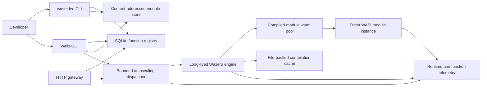
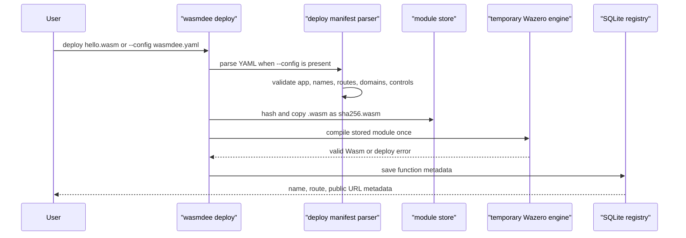
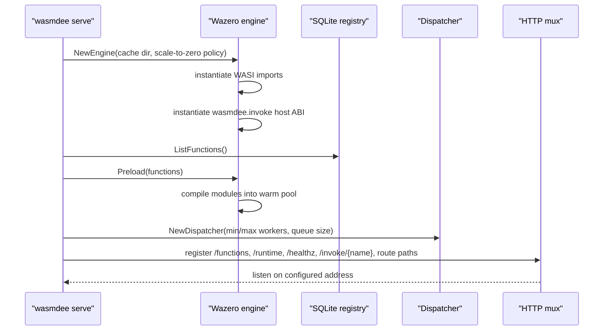
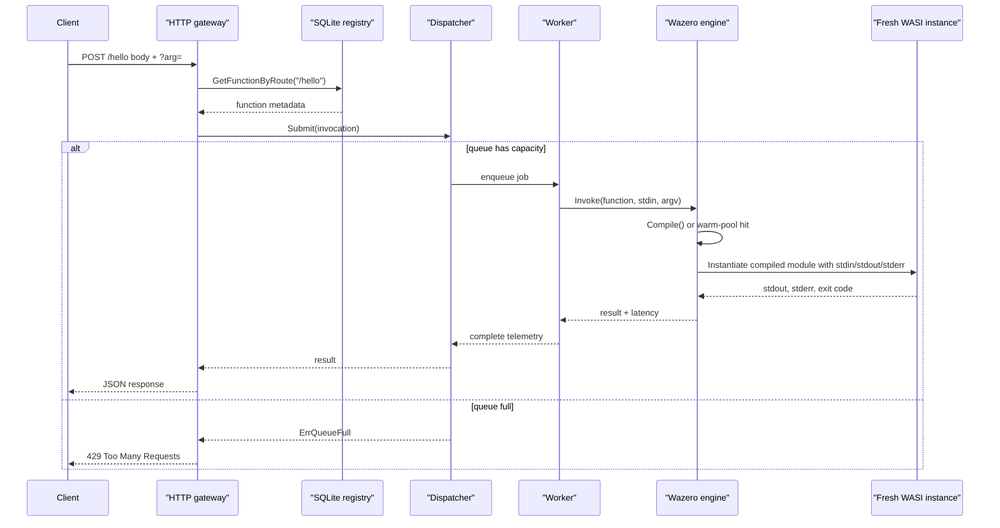
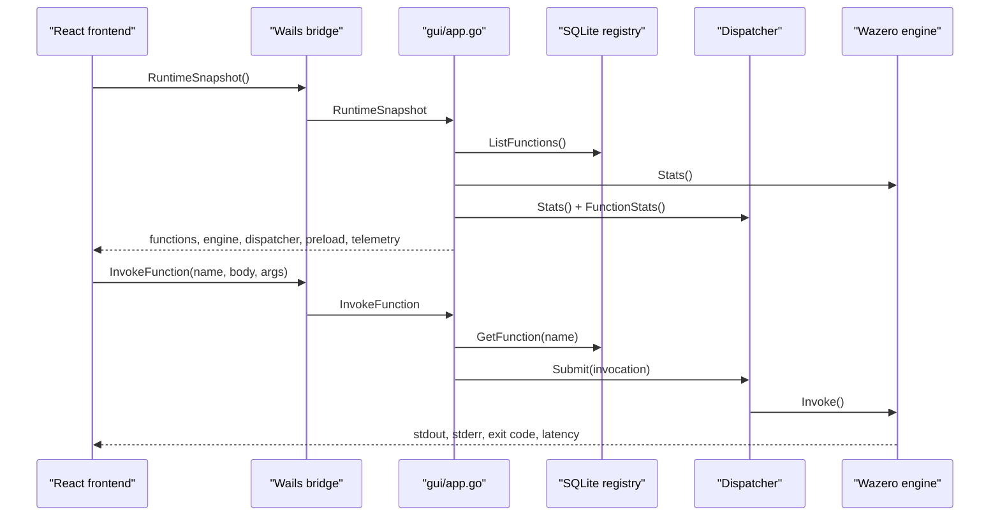
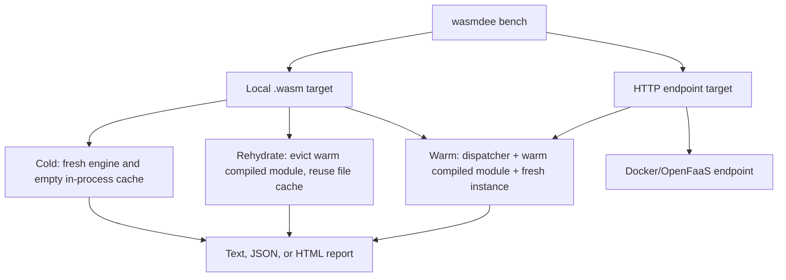
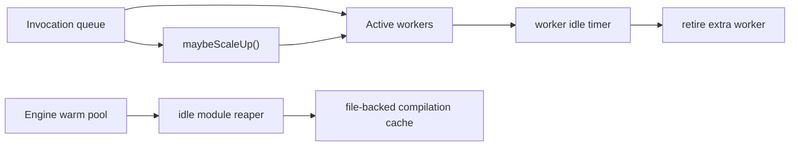
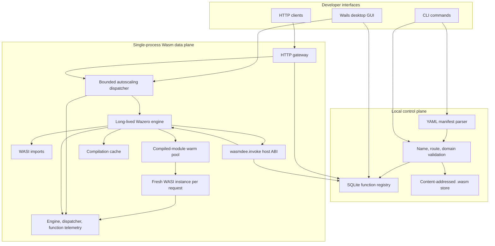

# System Trace

This document follows the implemented wasmdee code paths as they exist today.
It is meant to be the source material for architecture diagrams, talks, and
contributor onboarding.

## Mental Model

wasmdee is a local-first control plane plus a single-process Wasm data plane.
The durable control-plane state is small: a SQLite registry and a
content-addressed module store. The hot data-plane path is a long-lived Wazero
engine, a bounded autoscaling dispatcher, and one fresh WASI module instance per
invocation.

## Deploy Trace

Deploying a function is a metadata and validation operation. It does not create
a permanently running function process.

Implemented pieces:

- `internal/cli/deploy.go` owns command arguments and output.
- `internal/deploy/manifest.go` parses YAML deployments.
- `internal/deploy/validation.go` validates names, routes, and domains.
- `internal/deploy/deploy.go` hashes, stores, validates, and registers modules.
- `internal/state/db.go` persists function metadata.

Important boundary: public URLs and custom domains are metadata today. Actual
DNS, TLS, and external routing are future control-plane work.

## Gateway Startup Trace

`wasmdee serve` is where the hot path becomes long-lived. The process creates
one Wazero runtime, installs WASI and the experimental `wasmdee.invoke` host ABI,
optionally precompiles deployed modules, then starts an autoscaling dispatcher.

Implemented pieces:

- `internal/cli/serve.go` wires the gateway and JSON endpoints.
- `internal/runtime/executor.go` owns Wazero, WASI, compilation, and invocation.
- `internal/runtime/dispatcher.go` owns admission control and worker scaling.

## HTTP Invocation Trace

There are two HTTP invocation routes:

- `POST /invoke/{name}` resolves by function name.
- `POST /{route}` resolves by deployment route.

Both paths converge before execution.

Current isolation model:

- Shared: Go process, Wazero runtime, WASI imports, compiled modules, file-backed
  compilation cache, dispatcher workers.
- Per invocation: Wasm instance, linear memory, stdin/stdout/stderr buffers,
  argv, timeout context.

This is why the stable request path remains a compiled-module warm pool plus a
fresh WASI instance. The runtime now also records proto-faaslet templates and can
pre-instantiate modules that expose the experimental `wasmdee_handle` handler
ABI, but that handler path still needs an SDK and request/response ABI before it
becomes the normal invocation route.

## GUI Trace

The GUI is not a separate runtime model. It embeds the same runtime packages
behind Wails bindings.

Implemented pieces:

- `gui/app.go` initializes the embedded engine and dispatcher.
- `gui/frontend/src/lib/wasmdee-runtime.js` calls generated Wails bindings.
- `gui/frontend/src/pages/dashboard-page.jsx` renders the live snapshot.

Design boundary: the GUI should remain a client over the same deploy, state, and
runtime packages. It should not become a second control plane with different
semantics.

## Benchmark Trace

Benchmarking has two modes.

Local `.wasm` mode measures cold, rehydrate, and warm phases inside wasmdee.
HTTP mode measures round-trip latency for any POST endpoint. Docker and OpenFaaS
comparisons are valid only when those systems are actually running as endpoints
under the same payload, machine, concurrency, and iteration settings.

## Autoscaling and Scale-To-Zero Trace

Worker autoscaling is local process concurrency, not Kubernetes-style replica
autoscaling. Scale-to-zero currently evicts compiled modules from the in-process
warm pool while keeping the file-backed compilation cache. It is not yet
snapshot/CoW memory restore.

## End-To-End Architecture Diagram

## What To Say In A Review

The concise explanation:

> wasmdee pays runtime setup once per node, stores functions as Wasm modules
> instead of container images, admits requests through a bounded dispatcher, and
> executes stable WASI command requests as fresh isolated instances from a warm
> compiled module. The current system proves compiled-module reuse, route
> deployment, local autoscaling, scale-to-zero rehydration, proto-faaslet
> template tracking, handler-ABI pool scaffolding, direct host-call experiments,
> and benchmark reporting. Snapshot/CoW restore is the next research milestone,
> not a current launch claim.

## Current Truth Table

| capability | current behavior |
|---|---|
| YAML deployment | implemented |
| route-based HTTP invoke | implemented |
| public URL metadata | implemented, no DNS/TLS provisioning yet |
| long-lived runtime | implemented |
| compiled-module warm pool | implemented |
| proto-faaslet template store | implemented |
| handler-ABI instance pool | initial scaffolding |
| fresh memory per invocation | implemented |
| local worker autoscaling | implemented |
| compiled-module scale-to-zero | implemented |
| proto-faaslet snapshot/CoW restore | planned |
| lazy page restore/fork restore | research |
| Docker/OpenFaaS comparison | benchmark harness implemented; data must be measured |
